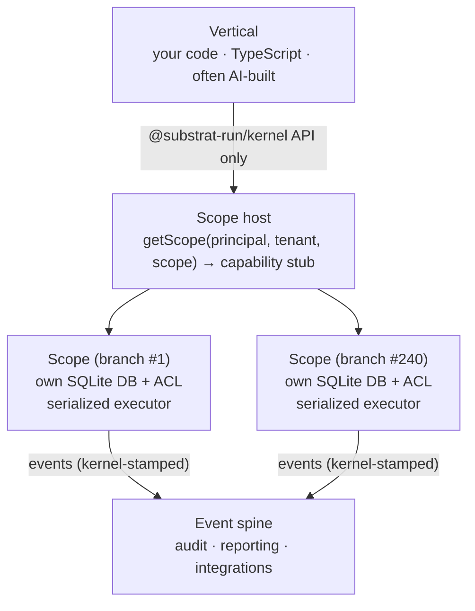

# Architecture

## Topology

The invariants this picture encodes:

- The **only** data path from vertical code to operational data is the scope stub.
  Holding a stub *is* the authorization to talk to that scope — and the scope still
  re-validates every call against its own ACL.
- **Events are emitted below the API surface.** Vertical code cannot emit on another
  scope's behalf, suppress an audit event, or edit its envelope.
- **Ambient tenancy.** After obtaining a stub, vertical code never passes tenant or
  scope IDs again — context rides inside the stub and the operation context. There is no
  ID parameter to get wrong.

## The scope: unit of isolation and consistency

A **scope** is one isolation domain — a housing association, a branch office, a client
company, a brand. Each scope has:

- **its own database** (one SQLite file locally; a SQLite-backed Durable Object in the
  planned Cloudflare adapter),
- **strict serialization** — one operation at a time, run to completion. No interleaved
  read-modify-writes, no lost updates, no need for row locking in module code,
- **a structured-clone boundary** — inputs and results are cloned even in-process, so
  code can never share mutable state with a scope.

Operations run *inside* the scope's execution domain: one hop to reach the scope, then
local, synchronous SQL. This is what makes engine invariants enforceable — the handler
sees `sql`, `emit`, and `check`; the caller sees only `invoke()`.

See [Tenants & scopes](/concepts/tenancy) and
[Operations & the scope host](/concepts/scope-host).

## Contracts first, adapters below

Every boundary-crossing data shape is a [Zod](https://zod.dev) schema in
[`@substrat-run/contracts`](/reference/contracts) — the reviewed artifact *is* the runtime
validator ("parse, don't trust"). The kernel's behavioral seams are pure TypeScript
interfaces in [`@substrat-run/kernel`](/reference/kernel) that import no platform APIs.

Platform specifics live only in **adapters**:

| Adapter | Backing | Use |
|---|---|---|
| [`@substrat-run/adapter-sqlite`](/reference/adapter-sqlite) | one SQLite file per scope, per-scope actor | local dev, CI, self-host |
| `@substrat-run/adapter-cloudflare` (planned) | Durable Object per scope | production |

The rule is testable and non-negotiable: **a module's contract tests must pass unchanged
on both adapters.** The pure-SQLite adapter is not a mock — it implements the same
semantics (serialization, clone boundary, fail-closed addressing, stamped envelopes) and
passes the same [conformance suite](/reference/contract-tests). This is what makes local
development deterministic, CI cloud-free, and the self-host/escrow story literally true.

## Modules: how everything joins

Engines and verticals join a host the same way — as **modules**. A module registration
bundles:

- a **manifest** — self-describing metadata: permissions (with human-readable
  descriptions), events emitted and consumed, migrations, attachment targets, entity
  relations, an entitlement key, and optional UI contributions;
- **migrations** — plain SQL, journaled per module, applied lazily per scope inside the
  scope's serialization domain;
- **operations** — named handlers (`'workorder/create'`) invoked through scope stubs;
- **event consumers** — handlers for event types other modules emit.

See [Modules & the manifest](/concepts/modules).

## Composition: star topology

Engines talk to the kernel, **never to each other**. No engine imports or calls a
sibling. Composition happens through three kernel-mediated channels:

1. **Opaque refs** — attachment contracts bind to `(entityType, entityId)` without
   knowing what the entity is.
2. **Events** — an engine reacts to another's schema-versioned events. A contract, not a
   call: the [invoicing engine](/engines/invoicing) consumes `workorder.completed` *and*
   `commerce.order-placed` — events from two different domains — without importing a single
   type from either producer.
3. **Vertical-owned orchestration** — synchronous flows that need two engines are wired
   in the vertical, where the glue is visible and editable.

This keeps compatibility at *N* kernel contracts instead of *N²* engine pairs, and keeps
each engine independently versioned. The corollary test: *if two engines need chatty
synchronous communication, they are one engine drawn wrong* — which is why "work orders +
time reporting" is one engine, not two.

## Language: TypeScript end-to-end

Verticals are TypeScript regardless of what the kernel is written in — React UIs,
prompt-to-app tools, and coding agents all emit it. Keeping the kernel in TypeScript
means one source of truth at the most important interface in the system: "invalid states
unrepresentable" materializes directly at the SDK boundary (branded ID types, discriminated
unions, literal types) rather than through generated bindings.

Types erase at runtime, so they are never the enforcement: every trust boundary validates
at runtime with the same Zod schemas, and the guarantees that matter are structural — the
scope boundary, capability stubs, kernel-side stamping — not type-level. Types are
ergonomics, especially for agents; the enforcement doesn't depend on the compiler.
