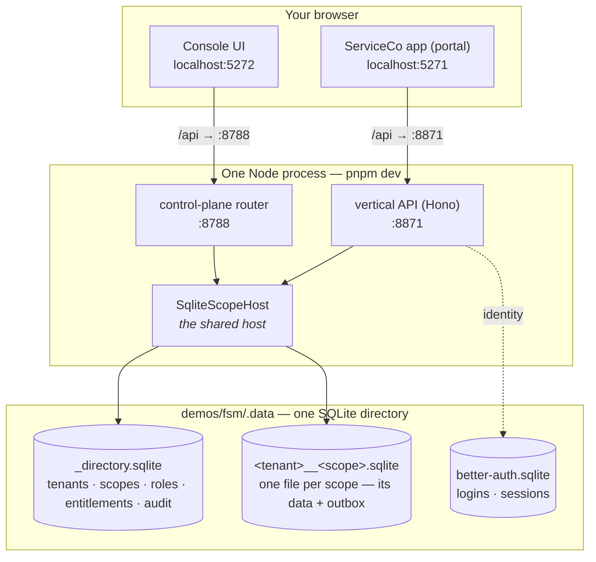
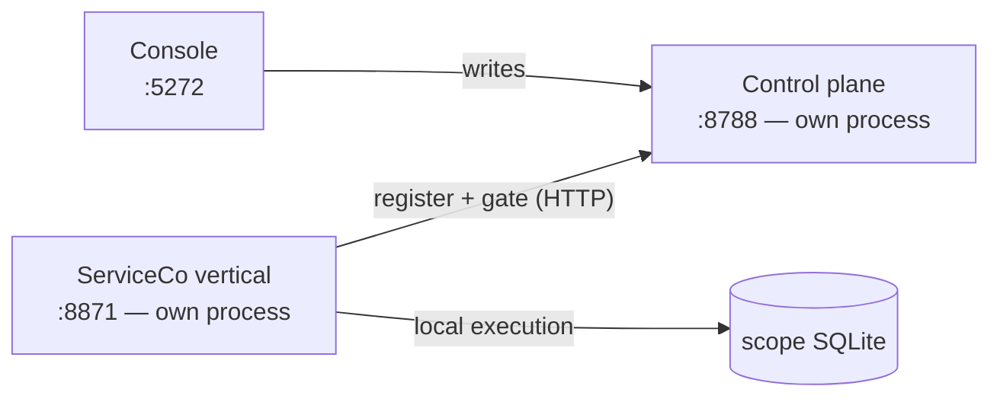

# Running the whole stack locally

[Getting started](/guide/getting-started) builds one host in one script. This page is the
other end: the **entire** flow — a vertical, the shared control plane, and the admin
console — running together on your machine with `pnpm dev` and nothing but local SQLite.
No cloud account, no Docker, no second datastore.

::: tip This is a monorepo command
`pnpm dev` at the root of the [substrat monorepo](https://github.com/substrat-run/substrat)
runs the ServiceCo demo vertical (`demos/fsm`) wired to the console (`apps/console`). It is
the reference for what a local stack looks like, not a published tool.
:::

## One command

```sh
pnpm dev
```

It ends on a banner telling you where to go:

```
  substrat · local stack — one process, one SQLite dir
  ────────────────────────────────────────────────────
    ▶ Console (open this)   http://localhost:5272
    ▶ Portal — ServiceCo    http://localhost:5271

      vertical API          http://localhost:8871
      control plane API     http://localhost:8788
  ────────────────────────────────────────────────────
    data   …/demos/fsm/.data
```

Open the **console** to act as the platform operator (tenants, scopes, entitlements,
suspend). Open the **portal** to act as a tenant's user (log in as a persona, do work).

## What is actually running

The surprising part — and the thing that makes the flow real rather than mocked — is that
there is **one backend process**. The vertical API and the control plane are two HTTP
listeners over the **same `SqliteScopeHost`**, which owns both the directory and every
scope's data. Two browser apps (Vite dev servers) sit in front, each proxying `/api` to
its own listener.



Because the control plane and the vertical share **one host**, they share **one
directory**. That is why a suspend in the console immediately fails the portal's next
action closed: `getScope` reads the scope's status from `_directory.sqlite` on every call,
and the console just wrote to that same row. There is no sync, no second copy — it is one
`UPDATE` and one `SELECT` against the same file.

### The processes

| Port | Process | What it is |
|---|---|---|
| `5272` | Vite dev server | The **console** — the platform operator's admin UI |
| `5271` | Vite dev server | The **portal** — ServiceCo's tenant-facing app |
| `8871` | Node (Hono) | The **vertical API** — resolves a user, `getScope`, invokes operations |
| `8788` | Node (Hono) | The **control plane** — the audited directory surface the console drives |

The two Node listeners are the *same process* sharing one host; the two Vite servers are
separate. All four are launched and torn down together by `pnpm dev`.

### The databases

Everything lives under `demos/fsm/.data` as plain SQLite files (WAL mode — the `-wal` /
`-shm` siblings are SQLite's, not yours to touch):

| File | Owned by | Holds |
|---|---|---|
| `_directory.sqlite` | the shared host | The directory: tenant registry, scope records + lifecycle status, roles, entitlements, tenant-level permission tuples, and the admin audit log |
| `<tenantId>__<scopeId>.sqlite` | the shared host | One per scope — that scope's own tables, permission tuples, and event outbox. Isolated: a scope is its own database and consistency domain |
| `better-auth.sqlite` | the vertical's auth | Identities, credentials, and sessions for the portal's logins |

Debugging is opening a file:

```sh
sqlite3 demos/fsm/.data/_directory.sqlite 'SELECT slug, status FROM scopes;'
```

Delete the `.data` directory to reset the world; it re-seeds on the next boot.

## Two audiences, one directory

The console and the portal are not two views of the same app — they are two **audiences**:

- The **console** is the platform operator. It reaches every tenant, and its actions
  (suspend a tenant, grant an entitlement) are cross-tenant. This is the surface [the
  platform layer](/concepts/platform) describes.
- The **portal** is one tenant's user, confined to their scope by the identity they logged
  in with. Anna sees ElMontage; Mallory sees a different tenant entirely.

From a scope's row in the console you can click **Portal ↗** to jump to that scope's app —
the local stand-in for the production hostname router that maps a domain to
`(tenant, scope, vertical)`.

## Adding tenants and scopes

Everything the console can do, it does against the running directory — so it is the fastest
way to change the local world:

- **New tenant:** the console's Tenants view has a *Create tenant* dialog. It mints a ULID
  and calls the same audited `createTenant` the platform uses.
- **Grant/revoke entitlements, suspend, archive:** all live in the console and take effect
  immediately, because they write the shared directory the portal reads.
- **New scope:** provisioning a scope is on the control-plane API (`POST /scopes`) but does
  not yet have a console button — the demo seeds its scopes in `demos/fsm/src/seed.ts`. Add
  one there, or `curl` the API with a platform-actor header.

## Adding another application

A "new application" is a new **vertical**. Today each vertical ships its own dev server
(the shop demo has its own; ServiceCo is `demos/fsm/src/server.ts`), and each composes its
engines + module into a host. To scaffold one, use the process in
[Getting started](/guide/getting-started) and the engines you need.

What is **not** wired yet is running several verticals against **one** shared console
locally — that needs each vertical to register into a *separate* control-plane process over
HTTP, rather than co-locating the directory in its own host as the demo does for
convenience. Until that seam exists, the local stack is one vertical + the console; the
console's fleet view is designed for the many-vertical world it will grow into.

## The faithful topology: `pnpm dev:connected`

`pnpm dev` co-locates the control plane and the vertical in one process for speed. To run
the shape production actually uses — a **separate** control plane that the vertical
*registers into* and is *gated by* — use:

```sh
pnpm dev:connected
```

This starts three things: a standalone control plane (its own process, on `:8788`), the
ServiceCo vertical in **connected mode**, and the console pointed at that control plane. On
boot the vertical registers its tenants and scopes into the control plane over HTTP; before
every request it asks the control plane "is this scope still active?" So when you suspend a
scope in the console, the vertical's next action fails closed — the same outcome as the
co-located stack, but now crossing a real process boundary, exactly as it would cross a
deployment boundary in production.



The seam is `ControlPlaneClient` from `@substrat-run/control-plane-api`: `createTenant` /
`provisionScope` / `grantEntitlement` to register, and `assertScopeActive` to gate. One
deliberate limit — the control-plane HTTP surface exposes lifecycle and entitlements but
**not role or grant writes** (those are the permission-diff human checkpoint), so a
connected vertical keeps its permission model local while the shared plane is authoritative
for tenant/scope lifecycle and entitlements.

Unlike the quick `pnpm dev` (which trusts a dev-actor header), the connected control plane
runs **real staff auth** — the console shows a sign-in screen. Sign in with the seeded
operator:

```
markus@substrat.run / substrat123
```

Auth is Better Auth behind a provider-agnostic seam (`sessionPlatformAuth` + a staff
allowlist), so who authenticates staff can change without touching the console or the
router. The vertical registering its scopes is a *service*, not staff — locally it uses the
dev-actor header as a stand-in for a real service credential.

## How production differs

Co-location is a local convenience, not the topology; `pnpm dev:connected` above is the
faithful shape on one machine. In production the control plane is its **own deployment** and
each vertical is a **separate deployment**, all reaching one durable directory — the same
surfaces you see here, split across processes and hosts. The SQLite adapter you run locally
and the Cloudflare adapter you deploy on are the same kernel above
[the scope-host contract](/concepts/scope-host); only the composition root changes.

## Next steps

- [Tenants & scopes](/concepts/tenancy) — the tenancy tree the directory records.
- [The platform layer](/concepts/platform) — what the console is a thin client over.
- [Operations & the scope host](/concepts/scope-host) — the seam that makes SQLite-local
  and Cloudflare-deployed the same code.
