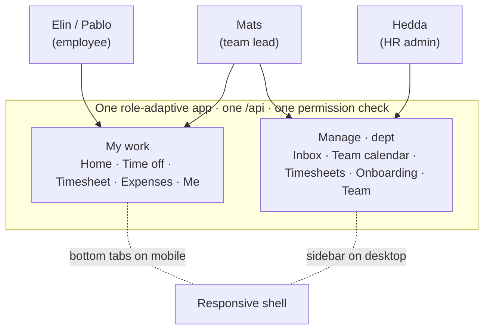

# Meridian (HR)

`demos/meridian` — a multi-country **HR vertical**: leave and absence, project time reporting,
expenses, onboarding, and the **anställningsavtal**, in **one role-adaptive app** that is an
employee's self-service tool and a manager's console at once.

## Overview

Meridian is the deliberate **shape-breaker**. Every other demo leans on a domain engine for
the work at its centre; Meridian has *none to lean on* — there is no absence engine, no
time-tracking engine, no expenses engine. So leave/absence, time reporting, and expenses are all **vertical code**,
and that is the point: it proves the kernel's guarantees — nested tenancy, permissions,
audit, GDPR — hold with **zero engine support**, and that Substrat's value isn't quietly
borrowed from the work-order state machine.

It's interesting for three reasons the field-service demos can't show:

- **A core domain with no engine.** The kernel carries leave, time and expenses alone. It
  does compose one engine — [`protocol`](/engines/protocol/), for onboarding checklists **and
  the employment contract** — but that sits beside the work rather than under it, and is
  itself the third proof of protocol reuse.
- **Two countries from one codebase.** Sweden (25 days + saved days, VAB) and Spain (22
  days, *registro de jornada*) are two scopes under one tenant, diverging by **data and
  per-scope config**, not a fork.
- **One app, two audiences.** An employee sees only their own record; a team lead who is
  *also* an employee gets a **Manage** section beside their own **My work** — the same app,
  the same permission checks, adapting to who signs in.

And it surfaces the platform's next engine: the **absence / entry-ledger** candidate
([engines](/engines/#engines-today)) — because its absence ledger and its time ledger are
the *same append-only shape* the work-order engine already owns.

## At a glance

| | |
|---|---|
| **Package** | `demos/meridian` (private) |
| **Tenancy shape** | 2 tenants — Nordljus AB (Sweden + Spain scopes) · Solmark AB (the cross-tenant attack victim) |
| **Engines composed** | [`protocol`](/engines/protocol/) — onboarding checklists **and** the anställningsavtal, both bound to an `employee` ref |
| **Own tables** | `hr_employees` · `hr_employment_terms` (append-only) · `hr_leave_types` · `hr_absence_ledger` (append-only) · `hr_leave_requests` · `hr_projects` · `hr_time_entries` (append-only) · `hr_expenses` · `hr_holidays` |
| **Roles** | `hr-admin` (tenant) · `manager` / `payroll` (scope) — employees are entity-narrowed grants, not a role |
| **Permission surface** | [`PERMISSIONS.md`](https://github.com/substrat-run/substrat/blob/main/demos/meridian/PERMISSIONS.md) — 21 keys, 3 roles |
| **App** | one role-adaptive React app (employee mobile + manager web), fjord-blue design system, light + dark |
| **Status** | Working — 14-case scenario green on the pure-SQLite adapter |

## Engines composed

Only one, and it's the reuse story: **`protocol`** — used **twice, in both of its content
kinds**, which makes Meridian the demo that shows the difference.

### A checklist: onboarding

`hr/start-onboarding` calls the engine's `instantiateProtocol(ctx, …)` bound to an
**`employee`** `EntityRef`, and the vertical declares the `protocol → employee` relation so
the permission walk reaches the employee's own-record grant. A nice twist: onboarding is
signed by the **employee** themselves (their own acknowledgement), not a supervisor — the
same engine as Callout, where the arbetsledare signs; the vertical's grant decides who holds
`protocol:sign`.

### A document: the anställningsavtal

An employment contract is not checklist-shaped. It has articles — a role, a salary, an
occupancy rate, a start date, a notice period — and they live in **this vertical's**
`hr_employment_terms` table. The engine never sees them. It gets a hash.

This checklist item used to exist:

```ts
{ key: 'anstallningsavtal', label: 'Anställningsavtal signerat', type: 'check' }
```

It's gone, and its removal is the lesson. **A checkbox recording that a contract was signed
is not evidence that it was.** The tempting fix — one item reading "I accept this contract",
with the real terms in the vertical — is worse than it looks: the engine's hash would cover
that sentence and nothing else, producing a signature that *looks* like evidence and isn't.

So the contract is a `document` protocol. `hr/issue-employment-contract` does three things in
one transaction: instantiate, `bindDocument` with `(contentRef, contentHash)`, and
`requestSignatures`.

::: warning What the engine proves, and what it doesn't
It proves a signature was made over exactly this hash, at this time, by this signatory, and
that the hash has not moved since. It **cannot** prove `hr_employment_terms` still hashes to
it — it never read that table.

Re-deriving the hash is the **vertical's** obligation. That is why `hr/verify-contract`
exists, and why the template's `hashRecipe` is a required field spelling the recipe out for
whoever opens this in five years.
:::

### Two signatories, two kinds

The asymmetry is the point, and HR is where it's most obviously true:

| Party | Kind | Why |
|---|---|---|
| **Arbetsgivaren** | `principal` | has an account, signs as themselves — the issuing party, so `primary` |
| **Den anställde** | `external` | a new hire has **no login on the day they sign** |

`hr_employees.principal_ref` has always been nullable — "the login principal, if this person
has one". Karin Berg is seeded with none: offered a job, contract out at Scrive, not yet an
employee. Her signatory ref is the opaque **employee id**, the same `DataSubjectId`
`hr.employee-created` already crypto-shreds on — **never `national_id`**, which is this
vertical's declared shred target and would become permanent in a table nothing can edit.

While the contract is out it sits in `pending_signature`: **frozen**. No rebind, no fill. It
reaches `signed` only when *both* parties have signed — one signature, or a decline, is not
completion.

::: danger Nothing can complete this in the running demo
`protocol/record-signature` is what a Scrive webhook would call, and there is **no webhook
ingress** ([#96](https://github.com/substrat-run/substrat/issues/96)) and **no way for a
non-principal callback to invoke a scope operation**
([#97](https://github.com/substrat-run/substrat/issues/97)).

`hr-admin` holds `protocol:bind` and `protocol:request-signature` — it can freeze and
dispatch. It does **not** hold `protocol:record-signature`, and neither does any other role:
asserting that someone signed with BankID is the provider's word, not HR's. The scenario test
mints a throwaway principal to stand in for the connector, and that stub deliberately lives
in the **test** rather than the seed — a seeded "connector principal" in a reference
implementation would quietly become the answer to #97 before #97 is designed.

So the demo opens on a contract that is frozen and pending, and stays there. That is the
honest state of the platform.
:::

Everything else is vertical code — and the most interesting part is what *isn't* an engine
yet. **Two ledgers, one shape:**

- `hr_absence_ledger` — vacation/absence, where an entry moves a **balance** (accrual `+`,
  booking `−`, correction, carryover). Balance is a fold; the current value is never stored.
- `hr_time_entries` — worked hours booked to a **project** ref, where an entry moves no
  balance.

Both are append-only (a correction is a new row), both fold to a value, both emit an event
per write — the *identical discipline* the work-order engine already owns for order-bound
time. That three unrelated capabilities want the same invariant is the signal that an
**entry-ledger engine** should be extracted once a second HR-shaped consumer forces it. Its
generic core may even belong in the kernel (a ledger-entries attachment contract); the
domain semantics — accrual, the approval state machine, the no-negative-beyond-policy floor
— stay in the engine. Until then it is honest vertical code with the invariants written
cleanly, so the extraction is later mechanical.

The variable-pay **payroll export** is the Callout *invoice basis* pattern re-cast:
approved absence + expenses leave as a file for a payroll provider. Payroll itself is a
deep-domain moat — integrated, never rebuilt.

## The cast & what's denied

Six principals span the whole matrix — pure employee, dual-role, pure manager, and an
attacker:

| Persona | Holds | Sees |
|---|---|---|
| **Elin** (SE) · **Pablo** (ES) | entity-narrowed grant on their own `employee` record | **My work** only — their own balance, timesheet, expenses, onboarding |
| **Karin** (SE) | *nothing* — no principal at all | she is a signatory, not a user: her contract is out for BankID signature before she has an account |
| **Mats** — team lead | `manager` role **and** his own employee record | **My work + Manage** — the dual-role case |
| **Petra** | `payroll` role | the variable-pay export |
| **Hedda** | `hr-admin` role (tenant-level) | **Manage** across both country scopes |
| **Mallory** | `hr-admin` in *Solmark AB* | nothing of Nordljus — the attacker |

The denials the [scenario](#run-it) asserts — because denials *are* the demo:

- an employee **cannot approve their own leave**, read a colleague's balance, or enumerate
  the team (`hr/roster` is gated on node-level `absence:read`, which employees hold only per-entity);
- a manager **sees their department but never compensation** — the roster read carries no
  `national_id` or salary;
- **cross-tenant**: Mallory operating from Solmark's scope reaches *none* of Nordljus's data —
  the isolation holds structurally, not by a filter someone remembered to add.

The full surface — every key, which role holds it, and the entity-narrowed grant shapes — is
the checked-in [`PERMISSIONS.md`](https://github.com/substrat-run/substrat/blob/main/demos/meridian/PERMISSIONS.md),
re-emitted by CI so it can't drift from what runs.

## The app

One React app, composed over the vertical's single API, that **adapts to the principal and
the viewport**. The nav is gated on what you *are* — an employee record grants **My work**,
manager/HR permissions grant **Manage** — and the layout switches with the screen:



- **Employee (mobile-first)** — a vacation-balance hero, and four one-handed, low-typing
  flows: request time off (with live balance impact), log time (append-only, hours stepper),
  submit expense (camera-first), and e-sign onboarding.
- **Manager (desktop-led)** — an approvals **Inbox** (decline always takes a reason), a team
  **absence calendar**, **timesheet** review, **onboarding** tracking, and a salary-free
  **team** roster. Onboarding cards distinguish the two protocol kinds: a checklist shows a
  progress bar, a contract shows *"Frozen at Scrive · 2 signatures outstanding"* — because
  rendering a document as `0/1` would misdescribe what is actually happening to it.
- **Design system** — the fjord-blue "Meridian" palette, a colourblind-safe leave-type
  palette (every colour paired with a shape), light and dark. The employee and manager
  surfaces read as one system because they *are* one app.

## Run it

```sh
pnpm --filter @substrat-run/demo-meridian dev
```

Starts the API on `:8875` and the app on `:5275`. Open it, resize the window to watch the
shell move between bottom-tabs and sidebar, and switch personas (Elin → Mats → Hedda) to
watch the sections adapt.

The executable spec is the scenario test — fourteen cases replayed headlessly on the
pure-SQLite adapter:

```sh
pnpm --filter @substrat-run/demo-meridian test
```

It asserts the ledger fold (request → approve drops the balance 25 → 22), the approval state
machine (can't skip, can't re-decide), the no-negative floor, the self-service and
cross-tenant **denials**, onboarding reuse, Sweden/Spain diverging from the same code, and
the contract flow end to end — that a document is bound by hash and never read by the engine,
that `pending_signature` refuses a rebind, that two signatories of *different kinds* are
needed before it is signed, that a provider reporting a hash we never froze **fails closed**,
and that HR cannot speak for the provider.

The `PERMISSIONS.md` and the append-only migrations (`0001-init`, `0002-employment-terms`)
are the human checkpoints the platform makes unskippable.
