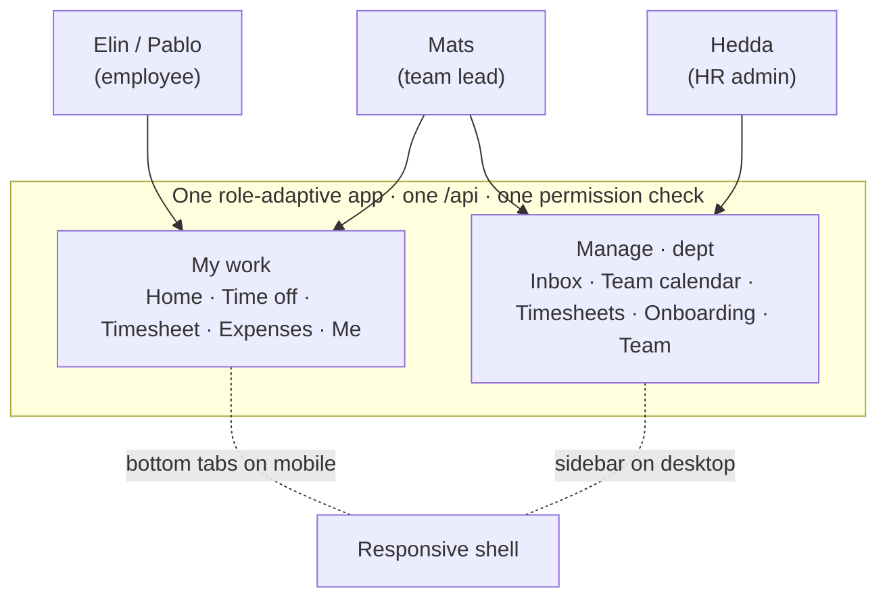

# Meridian (HR)

`demos/meridian` — a multi-country **HR vertical**: leave and absence, project time reporting,
expenses, and onboarding, in **one role-adaptive app** that is an employee's self-service
tool and a manager's console at once.

## Overview

Meridian is the deliberate **shape-breaker**. Every other demo leans on a domain engine for
the work at its centre; Meridian has *none to lean on* — there is no absence engine, no
time-tracking engine, no expenses engine. So leave/absence, time reporting, and expenses are all **vertical code**,
and that is the point: it proves the kernel's guarantees — nested tenancy, permissions,
audit, GDPR — hold with **zero engine support**, and that Substrat's value isn't quietly
borrowed from the work-order state machine.

It's interesting for three reasons the field-service demos can't show:

- **A core domain with no engine.** The kernel carries leave, time and expenses alone. It
  does compose one engine — [`protocol`](/engines/protocol/), for onboarding checklists —
  but that sits beside the work rather than under it, and is itself the third proof of
  protocol reuse.
- **Two countries from one codebase.** Sweden (25 days + saved days, VAB) and Spain (22
  days, *registro de jornada*) are two scopes under one tenant, diverging by **data and
  per-scope config**, not a fork.
- **One app, two audiences.** An employee sees only their own record; a team lead who is
  *also* an employee gets a **Manage** section beside their own **My work** — the same app,
  the same permission checks, adapting to who signs in.

And it surfaces the platform's next engine: the **absence / entry-ledger** candidate
([engines](/engines/#engines-today)) — because its absence ledger and its time ledger are
the *same append-only shape* the work-order engine already owns.

## At a glance

| | |
|---|---|
| **Package** | `demos/meridian` (private) |
| **Tenancy shape** | 2 tenants — Nordljus AB (Sweden + Spain scopes) · Solmark AB (the cross-tenant attack victim) |
| **Engines composed** | [`protocol`](/engines/protocol/) — onboarding checklists, bound to an `employee` ref |
| **Own tables** | `hr_employees` · `hr_leave_types` · `hr_absence_ledger` (append-only) · `hr_leave_requests` · `hr_projects` · `hr_time_entries` (append-only) · `hr_expenses` · `hr_holidays` |
| **Roles** | `hr-admin` (tenant) · `manager` / `payroll` (scope) — employees are entity-narrowed grants, not a role |
| **Permission surface** | [`PERMISSIONS.md`](https://github.com/substrat-run/substrat/blob/main/demos/meridian/PERMISSIONS.md) — 18 keys, 3 roles |
| **App** | one role-adaptive React app (employee mobile + manager web), fjord-blue design system, light + dark |
| **Status** | Working — 9-test scenario green on the pure-SQLite adapter |

## Engines composed

Only one, and it's the reuse story: **`protocol`** for onboarding. `hr/start-onboarding`
calls the engine's `instantiateProtocol(ctx, …)` bound to an **`employee`** `EntityRef`, and
the vertical declares the `protocol → employee` relation so the permission walk reaches the
employee's own-record grant. A nice twist: onboarding is signed by the **employee**
themselves (their own acknowledgement), not a supervisor — the same engine as Callout,
where the arbetsledare signs; the vertical's grant decides who holds `protocol:sign`.

Everything else is vertical code — and the most interesting part is what *isn't* an engine
yet. **Two ledgers, one shape:**

- `hr_absence_ledger` — vacation/absence, where an entry moves a **balance** (accrual `+`,
  booking `−`, correction, carryover). Balance is a fold; the current value is never stored.
- `hr_time_entries` — worked hours booked to a **project** ref, where an entry moves no
  balance.

Both are append-only (a correction is a new row), both fold to a value, both emit an event
per write — the *identical discipline* the work-order engine already owns for order-bound
time. That three unrelated capabilities want the same invariant is the signal that an
**entry-ledger engine** should be extracted once a second HR-shaped consumer forces it. Its
generic core may even belong in the kernel (a ledger-entries attachment contract); the
domain semantics — accrual, the approval state machine, the no-negative-beyond-policy floor
— stay in the engine. Until then it is honest vertical code with the invariants written
cleanly, so the extraction is later mechanical.

The variable-pay **payroll export** is the Callout *invoice basis* pattern re-cast:
approved absence + expenses leave as a file for a payroll provider. Payroll itself is a
deep-domain moat — integrated, never rebuilt.

## The cast & what's denied

Six principals span the whole matrix — pure employee, dual-role, pure manager, and an
attacker:

| Persona | Holds | Sees |
|---|---|---|
| **Elin** (SE) · **Pablo** (ES) | entity-narrowed grant on their own `employee` record | **My work** only — their own balance, timesheet, expenses, onboarding |
| **Mats** — team lead | `manager` role **and** his own employee record | **My work + Manage** — the dual-role case |
| **Petra** | `payroll` role | the variable-pay export |
| **Hedda** | `hr-admin` role (tenant-level) | **Manage** across both country scopes |
| **Mallory** | `hr-admin` in *Solmark AB* | nothing of Nordljus — the attacker |

The denials the [scenario](#run-it) asserts — because denials *are* the demo:

- an employee **cannot approve their own leave**, read a colleague's balance, or enumerate
  the team (`hr/roster` is gated on node-level `absence:read`, which employees hold only per-entity);
- a manager **sees their department but never compensation** — the roster read carries no
  `national_id` or salary;
- **cross-tenant**: Mallory operating from Solmark's scope reaches *none* of Nordljus's data —
  the isolation holds structurally, not by a filter someone remembered to add.

The full surface — every key, which role holds it, and the entity-narrowed grant shapes — is
the checked-in [`PERMISSIONS.md`](https://github.com/substrat-run/substrat/blob/main/demos/meridian/PERMISSIONS.md),
re-emitted by CI so it can't drift from what runs.

## The app

One React app, composed over the vertical's single API, that **adapts to the principal and
the viewport**. The nav is gated on what you *are* — an employee record grants **My work**,
manager/HR permissions grant **Manage** — and the layout switches with the screen:



- **Employee (mobile-first)** — a vacation-balance hero, and four one-handed, low-typing
  flows: request time off (with live balance impact), log time (append-only, hours stepper),
  submit expense (camera-first), and e-sign onboarding.
- **Manager (desktop-led)** — an approvals **Inbox** (decline always takes a reason), a team
  **absence calendar**, **timesheet** review, **onboarding** tracking, and a salary-free
  **team** roster.
- **Design system** — the fjord-blue "Meridian" palette, a colourblind-safe leave-type
  palette (every colour paired with a shape), light and dark. The employee and manager
  surfaces read as one system because they *are* one app.

## Run it

```sh
pnpm --filter @substrat-run/demo-meridian dev
```

Starts the API on `:8875` and the app on `:5275`. Open it, resize the window to watch the
shell move between bottom-tabs and sidebar, and switch personas (Elin → Mats → Hedda) to
watch the sections adapt.

The executable spec is the scenario test — nine cases replayed headlessly on the pure-SQLite
adapter:

```sh
pnpm --filter @substrat-run/demo-meridian test
```

It asserts the ledger fold (request → approve drops the balance 25 → 22), the approval state
machine (can't skip, can't re-decide), the no-negative floor, the self-service and
cross-tenant **denials**, onboarding reuse, and Sweden/Spain diverging from the same code.
The `PERMISSIONS.md` and a single append-only `0001-init` migration are the two human
checkpoints the platform makes unskippable.
