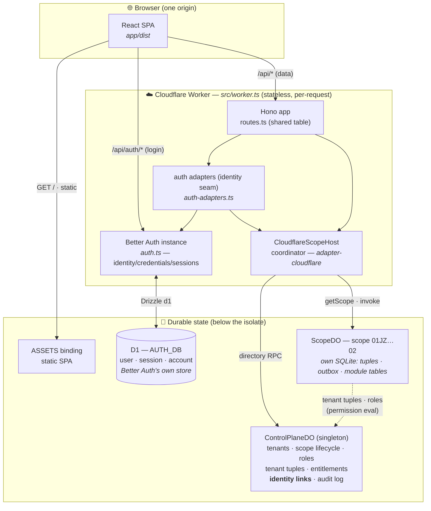
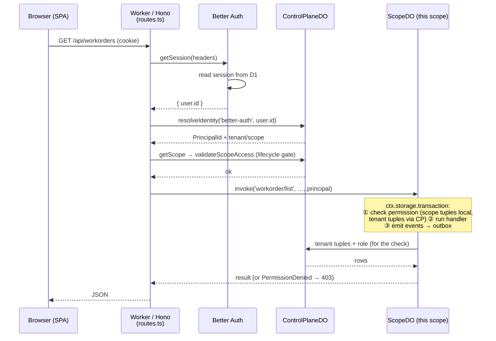
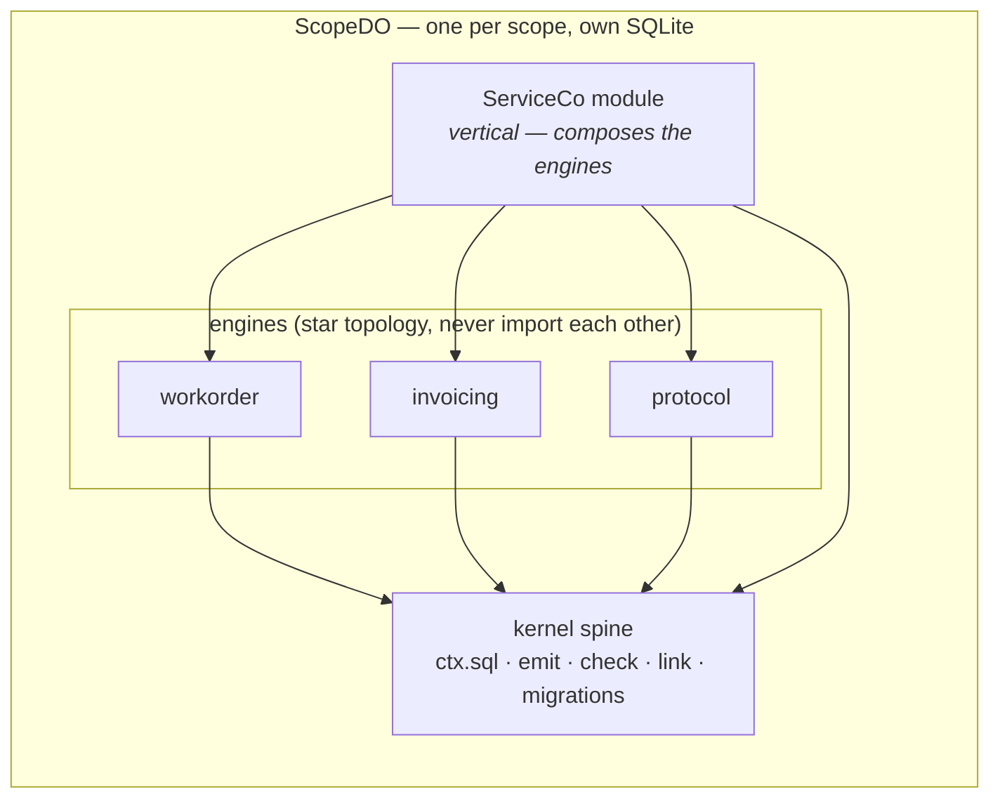

# FSM demo — "ServiceCo"

The first demo vertical: a small Swedish service/installation firm built on the
Substrat kernel and the work-order + invoicing engines. **Runs end-to-end**: React UI →
Hono API → kernel operations → per-scope SQLite, with the tuple permission engine
enforcing every call.

## Run it

```bash
pnpm install
pnpm fsm-demo dev   # from anywhere in the repo — starts API (:8871) + web app (:5271)
```

(`pnpm fsm-demo <script>` is a root-level pass-through to this package: `dev`,
`server`, `test`, `typecheck` all work.)

Ports sit in a private `887x`/`527x` block so they don't fight Vite's `5173` or
Wrangler's `8787` default. If either is taken, `PORT=9001 WEB_PORT=5999 pnpm
fsm-demo dev` moves both ends of the proxy together.

Open http://localhost:5271 and **sign in** as any persona (auth is Better Auth on
both the node server and the Worker — see below; password is `demo1234` for all):

| Sign in as | Role | What to try |
|---|---|---|
| `anna@elmontage.se` (kontor) | office-admin | Create a work order, assign Harald, complete it — the priced review sheet shows min-qty and dropped internal articles; then export the fakturaunderlag |
| `harald@elmontage.se` (tekniker) | technician | Start the job, report time and material; try assigning — denied |
| `berit@brfgrunden.se` (portal) | BRF Grunden customer | Sees exactly her organization's orders — via a tuple proof walk, not UI filtering |
| `styrbjorn@kontorshotellet.se` (portal) | Kontorshotellet customer | Sees nothing of Berit's orders |
| `mallory@rorservice.se` | office-admin of *another firm* | Logs into her **own** tenant — sees none of ElMontage's data (empty lists), because she resolves to a different tenant/scope entirely |

Data lives in `demos/fsm/.data/*.sqlite` — open any scope file in a SQLite browser;
that's the escrow story, live. Delete `.data/` to reseed.

## On Cloudflare

The exact same vertical runs unchanged on the real Cloudflare runtime — the node
dev server ([src/server.ts](src/server.ts)) and the Worker ([src/worker.ts](src/worker.ts))
mount **one shared route table** ([src/routes.ts](src/routes.ts)) and the same Better
Auth seam ([src/auth-adapters.ts](src/auth-adapters.ts)); only the *adapter* underneath
differs. On the node server the pure-SQLite host backs the scopes and Better Auth's own
store; on Cloudflare those become Durable Objects and a D1 database respectively.

```bash
pnpm --dir demos/fsm cf:dev      # build the SPA + run the Worker on real workerd (local DOs, no account)
pnpm --dir demos/fsm cf:deploy   # ship it (needs a Workers Paid plan — DO SQLite)
```

### How the pieces connect

Everything lives behind **one origin**: the Worker owns `/api/*`, and the same-origin
`ASSETS` binding serves the built React SPA (so Better Auth's session cookie is
same-origin — no CORS). The Worker isolate itself is **stateless**: the Better Auth
instance and the `CloudflareScopeHost` coordinator are rebuilt per request. All durable
state lives below it — in D1 and the Durable Objects.



**Authentication vs. authorization stay split.** Better Auth owns *authentication*
only (who you are) in its own D1 database; the kernel keeps *authorization*
(roles/grants/tenancy) in the Durable Objects. The bridge between them is the
**identity seam**: a Better-Auth `userId` is mapped to a kernel `PrincipalId` through
`resolveIdentity` in the ControlPlaneDO. That's why Better Auth's org/RBAC plugins stay
off — and why an OIDC/SSO adapter later is pure config on the same seam, no kernel change.

### One authenticated request, end to end

An authenticated data call (say `GET /api/workorders`, session cookie attached) crosses
each boundary exactly once — auth seam → coordinator → the scope's own Durable Object,
where the operation runs inside a single SQLite transaction with the tuple checker
enforcing the permission:



### What's inside a ScopeDO

A ScopeDO **is the app binary**: `defineScopeDO([...MODULES])` bundles the kernel spine,
the three engines, and the ServiceCo vertical module into one code-time set (a DO can't
receive handler closures over RPC), each with its own SQLite. One DO instance per scope,
addressed by `scopeId`; the coordinator just routes to it. This is the direct CF analogue
of a single `SqliteScopeHost` scope in the node run — same engines, same invariants, same
migrations, same tuple checker.



## Specs

- **Concept:** [spec/concept.md](spec/concept.md)
- **Implementation spec** (schemas, operations, events, permissions, scenario):
  [spec/testrun.md](spec/testrun.md)
- **View specifications:** [spec/views.md](spec/views.md)

`pnpm --filter @substrat-run/demo-fsm test` runs the headless nine-step scenario from
spec/testrun.md §8.

Demo verticals under `demos/` are private and never published. The engines they consume
live in `engines/` — product seeds shared across demos, not demo material.
