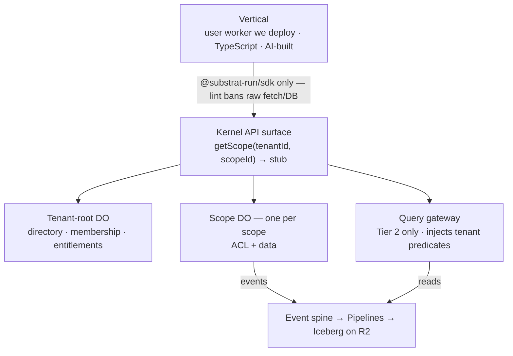

# Substrat Kernel — Design Document

Status: draft v0.1 · Last updated: 2026-07-14

> **Relationship to the master plan.** [docs/master-plan.md](../master-plan.md) is canonical
> for strategy, architecture *decisions*, and the decision log — this document never
> re-decides anything decided there. This document is canonical for the technical *shape*
> of those decisions: contracts, data models, interfaces, lifecycles. Where a shape here
> turns out to force a strategy change, the master plan gets a decision-log entry first,
> then this document follows. Section references like (§5.2) point into the master plan;
> references like (D-4) point to its decision log.

Anonymization follows the master plan: **PropCo**, **HouseCo**, **POSCo**, **MediaCo**,
**the auth platform**, **the FSM vendor**.

---

## 1. Purpose, scope, non-goals

**Purpose.** Specify the kernel precisely enough that (a) implementation can start on
case 1 (förvaltar-OS, §8.1), (b) the techy friend's RFC (§13.3) can be exported from it,
and (c) the agent-loop acceptance test (§5.6) has concrete contracts to run against.

**Scope — the one-step-ahead rule (§6) applied.** This document designs, in order of
retrofit brutality:

1. Tenancy model + directory + provisioning (§5.1, D-3)
2. Permission model (D-16)
3. Event envelope + spine (§5.3, D-5)
4. Module manifest + attachment contracts (D-1)
5. Scope-host contract and the two storage shapes (§5.2, D-4, D-14)
6. The adapter seam for everything the kernel consumes (§5.7, D-18)
7. i18n conventions (§6)

**Non-goals for v0.1.** Engines (work orders, protocols — designed in their own docs when
case 1 forces extraction); the integrations hub beyond its contract stub; billing rails;
the AI gateway; spec-registry tooling (§5.6 defers it); anything only a second vertical
would consume.

## 2. System topology



Invariants this picture encodes (§4):

- The **only** data path from vertical code to operational data is the scope stub. The
  stub is capability-scoped: holding it *is* the authorization to talk to that scope, and
  the scope DO still re-validates every call against its own ACL (§5.4).
- The **only** analytical path is the query gateway; it injects tenant/scope predicates
  before the query reaches the engine.
- Events are emitted by kernel/engine code below the API surface. Vertical code cannot
  emit, suppress, or edit audit events.
- Ambient tenancy (§7.8): vertical code never passes tenant/scope IDs after obtaining a
  stub — context rides inside the stub.

## 3. Core data model: tenant, scope, directory

### 3.1 Entities

```ts
interface Tenant {
  id: TenantId;               // branded string, ULID
  slug: string;               // stable, URL-safe, unique
  name: string;
  status: 'active' | 'suspended' | 'deleting';
  createdAt: Instant;
}

interface Scope {
  id: ScopeId;                // branded, ULID; globally unique (not per-tenant)
  tenantId: TenantId;
  parentScopeId: ScopeId | null;  // v1: always null (two levels); field exists so
                                  // deeper trees are additive, not a migration
  slug: string;               // unique within tenant
  kind: string;               // vertical-defined vocabulary: 'brf', 'filial', 'brand'…
  name: string;
  status: 'provisioning' | 'active' | 'suspended' | 'archiving' | 'archived';
  storageShape: 'A' | 'B';    // §5.2; fixed at provisioning, migration is explicit
  jurisdiction: 'eu' | null;  // CF DO jurisdiction; fixed at creation — a DO can
                              // never relocate. 'eu' default for our markets (§7.3)
  schemaVersion: string;      // last applied migration journal entry (§6 below)
  createdAt: Instant;
}
```

Decisions embedded here, open to challenge:

- **Two levels in v1, tree-ready schema.** Every known case is two-level (§5.1). The
  `parentScopeId` column ships day one because *the column* is cheap and *the retrofit*
  is not; the permission model (§4 below) is written against a path, not a level count.
- **ScopeId globally unique**, so a scope stub, an event, or an opaque ref never needs
  the tenant for disambiguation — but every kernel API still requires the pair
  `(tenantId, scopeId)` and cross-checks it, so a confused-deputy bug in vertical code
  fails closed instead of resolving to another tenant's scope.
- **`kind` is vertical vocabulary, not kernel enum.** The kernel never branches on it.

### 3.2 Directory

DOs are not enumerable (§5.2), so the directory is load-bearing: it is the **only**
complete inventory of tenants and scopes, and the input to reconciliation, migration
sweeps, billing (active-scope meter, §9), and ops.

- One **tenant-root DO** per tenant: scope registry for that tenant, membership, role
  assignments, entitlements. Lightweight by rule — it holds control-plane state only.
- One **global directory** (D1 in the Cloudflare adapter; a SQLite file in the pure
  adapter): tenant registry + denormalized scope index `(tenantId, scopeId, status,
  shape, schemaVersion, lastWakeAt)`.
- Write ordering: the tenant-root DO is the source of truth for its scopes; the global
  index is an async projection off its events, and reconciliation treats the tenant-root
  as authoritative. A scope missing from the global index is a *sweep bug*; a scope
  missing from its tenant-root is *corruption* and pages someone.

The directory is the spine of the **control plane** — the shared platform layer that the N
per-vertical deployments of §5.5 all sit on. The tenant registry, entitlement store,
hostname map, and admin audit log live here, and the admin's *effecting* surface (provision,
suspend, entitlement flips, admin-query RPC) is out-of-band host code rather than module
code, because K-8 leaves a vertical no addressable path to another vertical's scopes (K-20).
[control-plane.md](control-plane.md) is that design. Note that as of today the *tenant* half
of "complete inventory of tenants and scopes" above is **specified but not implemented**: no
adapter has a `tenants` table, and a tenant is a foreign-key string on scope rows.

### 3.3 Provisioning lifecycle

`provisioning → active → suspended ⇄ active → archiving → archived`

- Provisioning is idempotent and journaled in the tenant-root DO: create registry row →
  initialize scope DO (schema to current version, seed ACL) → mark active. A crash
  between steps re-runs safely.
- Jurisdiction is a provisioning-time decision: the scope DO is minted inside a
  jurisdiction sub-namespace (`env.SCOPE.jurisdiction('eu').newUniqueId()`) and the
  guarantee covers where the object runs **and** persists. It can never change after
  creation, which is why it lives on the `Scope` row, not in runtime config. The DO ID
  itself is logged outside the jurisdiction for billing/debug — fine (opaque ULIDs), but
  it belongs in the trust-page fine print.
- `archived` keeps the registry row and Tier 2 history forever (bokföringslagen, §5.3);
  the scope DO's storage is exported to R2 then released. Un-archive is a restore, not a
  flag flip — this keeps the "active scope" billing meter honest (§9).

## 4. Permission model

The model is kernel-owned; the evaluation engine is an adapter (D-16). The model must be
decided now (§6: "near-impossible to retrofit"), so this section is the highest-stakes
part of this document.

### 4.1 Authored surface: roles @ nodes + capability grants

What humans and agents write. Verticals never see the evaluation machinery below.

```ts
// The tree of assignable nodes: tenant root, or any scope.
type Node = { tenantId: TenantId; scopeId: ScopeId | null };  // null = tenant level

// A role is a named bundle of permissions, module-declared or vertical-declared.
interface RoleDefinition {
  key: string;                 // 'staff', 'field-tech', 'board-member', 'resident'
  permissions: PermissionKey[];// e.g. 'workorder:create', 'document:read'
  source: ModuleId | 'vertical';
}

// Assignment: a principal holds a role at a node; inheritance flows down the tree.
interface RoleAssignment {
  principalId: PrincipalId;    // user or service principal
  roleKey: string;
  node: Node;
}

// Capability grant: a narrow, direct, time-boxable permission at a node,
// bypassing roles. Also the cross-tenant mechanism (§5.4). The optional entity
// narrows the grant to one entity and its declared descendants — this is how
// portal customers see only THEIR facilities/orders inside a shared scope
// (the FSM shape: end customers within a filial; see the feature survey §8).
interface CapabilityGrant {
  principalId: PrincipalId;
  permission: PermissionKey;
  node: Node;
  entity?: EntityRef;          // entity-narrowed grant (portal customers)
  expiresAt?: Instant;
  grantedBy: PrincipalId;      // audited, always
}
```

**The check API — the seam the adapter sits behind (D-16):**

```ts
interface PermissionChecker {
  check(principal: PrincipalId, permission: PermissionKey, node: Node): Promise<Decision>;
  // An allow ALWAYS carries its proof: the tuple chain that granted access
  // (§4.2) — powering explain, "view as user" (§7.8), and the reviewable diff.
  explain(principal: PrincipalId, node: Node): Promise<EffectivePermissions>;
}
```

Rules unchanged by the evaluation choice:

- **Deny by default; no negative grants** (K-2). If a real case demands exceptions,
  model them as narrower roles; revisit only with a decision-log entry.
- **Inheritance is downward only** (tenant → scope → future sub-scopes).
- **Permission keys are module-namespaced** and declared in the module manifest (§7) —
  the manifest keeps "who can do what" enumerable and diffable.

### 4.2 Evaluation: a constrained relationship-tuple engine (K-12, plan D-23)

The built-in evaluator is a deliberately small FGA/Zanzibar-shaped engine. Internal
representation: `(subject, relation, object)` triplets —
`principal:… member org:…`, `org:… customer_of facility:…`,
`workorder:10024 parent facility:X`, `principal:… role:staff scope:…` — stored
scope-locally, with the tenant-level slice cached from the tenant-root DO and
invalidated by assignment events.

**The derivation algebra is fixed — four rules, not configurable:**

1. Role bundles expand to their permission keys.
2. Permissions inherit down the tenancy tree (`parent` edges between nodes).
3. Permissions flow along **manifest-declared entity parent edges** (§7.1
   `entityRelations`), depth-capped (4). This is what resolves
   "may Anna read workorder:10024?" → workorder→facility→customer-org→member.
4. Membership (principal → org/group).

No negation, no intersections, no vertical-authored rewrites. Every future "can we just
add…" against this list is a decision-log event, not a patch — the algebra's smallness
is what keeps `explain` and the §4.5 diff tractable.

**Why this is small here when Zanzibar is not:** Zanzibar's hard problems (snapshot
consistency, the new-enemy problem, zookies) exist because Google evaluates against a
globally distributed tuple store. Our tuples live in the scope's serialization domain
(§5.1): check-after-write consistency is free, and a revoked tuple is invisible to the
very next operation. What remains is a bounded recursive query over scope-local rows —
a few hundred lines behind `PermissionChecker`.

**Proof paths.** An allow returns the tuple chain that produced it. `explain` is the
same walk enumerated; "view as user" renders screens against it; the human checkpoint
diff renders tuple-set changes as "who gains what, where."

**OpenFGA stays the swap target** (D-16): the tuple model is conceptually OpenFGA's, so
the adapter swap is a data migration, not a remodel.

### 4.3 Identity sync: authhero organizations

Identity is a swappable adapter (D-16); authhero is the reference implementation. The
adapter **authenticates** and reports **membership**; the kernel owns the **enforcement
facts**. That division is invariant. What varies per audience is only where the identity
pool lives and how membership maps in — and there are three audiences, not one:

| Audience | Identity pool | Kernel expression (§4.1) |
|---|---|---|
| **Staff** (ours + tenant operators) | one **central** tenant; one **organization per Substrat tenant** | `RoleAssignment` at nodes |
| **Portal customers** (B2B companies inside a tenant's scope) | organization in the tenant's pool | membership tuple + entity-narrowed `CapabilityGrant` |
| **White-label consumers** (B2C, per shop/publisher) | **one auth tenant per Substrat tenant** | entity-narrowed `CapabilityGrant`, no role |

Login uses the existing refresh-token → org-scoped access-token exchange. Division of
labor:

- **Identity layer** (adapter): authentication, org membership management, session
  narrowing — the org claim selects which grants are active when the kernel entrypoint
  mints the stub (K-8).
- **Kernel** (canonical, D-16): the enforcement facts — membership tuples and
  entity-narrowed grants. Provisioning a portal customer creates both the kernel
  tuples and the authhero org/membership; **the org is a projection of the kernel
  directory, never the reverse**. Token claims are never trusted at data access — the
  owning scope re-evaluates tuples on every call (§5.4).

**Staff orgs carry roles, never permissions.** The org membership resolves to a coarse
role key (`admin`, `editor`) which the kernel expands via `RoleDefinition` (§4.1). Putting
permission *lists* in the identity layer forks the permission vocabulary into two systems
that drift, and guts §4.5's diff — the kernel must stay the only place "who can do what"
is enumerable. The identity layer says *which role*; the module manifest owns what that
role can do.

**Sync direction follows the projection rule.** Org membership/role changes land as kernel
`RoleAssignment`s (a directory sync). The alternative — deriving grants from token claims
per request, storing none — is rejected as the primary path: it leaves the grant tables
empty, so §4.5's "who gains/loses what, where" has nothing to render, and it makes every
check ride on token freshness. Synced grants stay self-contained, auditable, and enforce
through an identity-layer outage.

**Per-tenant pools make the identity key tenant-scoped.** With one auth tenant per
white-label consumer pool, an external subject id is unique only *within* its pool. The
directory's identity mapping is therefore keyed `(tenantId, provider, externalId) →
PrincipalId`. A globally-keyed mapping is a cross-tenant identity bleed — exactly what
separate pools exist to prevent, and the one invariant to get right on day one.

**Why consumers get a pool and staff get an org.** White-label forbids a shared,
cross-branded consumer pool: the consumer must never learn the platform exists, and a
consumer of two shops is correctly two accounts. Staff are the opposite — someone
administering five tenants wants **one** login, which is precisely what an org-per-tenant
membership on a central pool buys. Pushing staff down into the per-tenant pools would
trade that away for isolation they don't need.

**The `orgId ↔ tenantId` join is an explicit, stable directory row** — one per tenant,
never reconstructed from names or slugs. Both the staff seam and the sync hang off it.

**The IdP is not fronted (K-25).** Templates default to Better Auth, registered as
its own pool; the hosted product talks to authhero over OIDC **directly**, as a
second pool, rather than putting Better Auth in front of it. The directory stores
`(tenantId, provider, externalId)`, so whichever system mints that `externalId` is
the identity of record forever — fronting would pin the session library and leave
only the IdP swappable, which is backwards. Going direct is also what makes the org
claim available to select the tenant, instead of a header the client chooses.

**Topology is the enforceable fact, not audience (K-23).** The three rows above name
*audiences*, and the audience is descriptive shorthand. What the kernel can actually
enforce is a pool's **topology**: `central` (one pool serving many tenants — the same
`externalId` in two tenants is the same human) or `tenant-bound` (one pool serving exactly
one tenant — the same `externalId` in two tenants is a collision between two humans).

The two do not map one-to-one, which the RallyPoint demo makes concrete: a padel player is
a *consumer*, but on a **branded** platform where playing at several clubs is the product.
Clubs are tenants there, so that player wants the central topology the table above gives
only to staff. Read the audience column as "which topology this audience usually wants",
and the registry as the fact that decides.

Topology is what makes cross-tenant identity answerable at all. *"Which tenants is this
login in?"* is an enumeration, distinct from resolution, and it is **only safe on a central
pool** — on tenant-bound pools the same `externalId` across tenants names different people,
so enumerating would hand one person another's tenant list. A pool that has not declared
its topology cannot be reasoned about, so an unregistered provider is refused rather than
defaulted.

Reference topology: this is what our own auth platform runs for Sesamy today (~100
white-label publisher pools + a central staff tenant with an organization per publisher) —
the D-16 dogfooding, cashed in. `demos/callout` implements the staff row only, single-tenant,
with Better Auth as a second adapter behind the same seam (M3) — proof the seam is neutral,
not a second identity model.

### 4.4 What v1 must express (acceptance list)

From PropCo (§8.1): staff with tenant-wide roles; fältpersonal with a role at many-but-
not-all scopes; a styrelse member with a role at exactly one BRF scope; a boende with a
portal role at one scope; a subcontractor principal holding a time-boxed capability grant
into one scope from *another tenant* (the §8.4 wedge, designed-for now, shipped later).
From the FSM shape (feature survey §8): a **portal customer seeing only their own
facilities and orders inside a shared filial scope** — an entity-narrowed grant resolved
through declared entity parent edges (§4.2 rule 3). If the model can't express one of
these cleanly, the model is wrong — fix it here before schema.

### 4.5 Human checkpoint surface

Permission *definitions* (role definitions, manifest permission keys) change only via
reviewed migration — this is one of the two non-negotiable human checkpoints (§4 of the
plan). The kernel renders any such change as a single human-readable diff: which
principals gain/lose what, where in the tree (§7.8). Assignments (giving a user a role)
are runtime data, audited but not human-gated.

## 5. Scope-host contract and storage

### 5.1 The contract

```ts
interface ScopeHost {
  // Kernel authenticates the caller and mints the stub with trusted principal
  // context (K-8); a mismatched (tenantId, scopeId) pair fails closed (K-3).
  getScope(principal: PrincipalId, tenantId: TenantId, scopeId: ScopeId): Promise<ScopeStub>;
  // Modules register operations at composition time; handlers run INSIDE the scope.
  defineOperation<I, O>(name: string, handler: OperationHandler<I, O>): void;
}

// The stub is the enforcement primitive: capability-scoped (minted per principal
// per scope), revalidated by the owning scope on every call (§5.4), and the ONLY
// way code outside the scope reaches it. Callers invoke module-registered
// operations by name — closures can't cross RPC, and this is what keeps
// "one hop, then local queries" true in production (K-10).
interface ScopeStub {
  invoke<O, I>(operation: string, input?: I): Promise<O>;
}

// What an operation handler sees inside the scope — ambient tenancy, no IDs:
interface OperationContext {
  sql: ScopedSql;                      // module-owned tables in this scope only
  attachments: AttachmentApi;          // documents, comments, custom fields, timeline
  emit(event: DomainEventInput): void; // spine-bound; envelope stamped kernel-side
  check(permission: PermissionKey): Promise<Decision>;  // ambient principal + node
}
```

The adapter boundary sits exactly here (§5.7): the Cloudflare adapter backs the stub with
a Durable Object; the pure adapter backs it with an in-process actor holding one SQLite
file per scope, preserving serialized-execution semantics. **Contract tests run against
both, forever** (D-14).

Two semantics are pinned as *contract*, not adapter behavior (K-6; resolves former open
question 7):

- **Strict serialization per scope.** Operations on one scope execute one at a time, to
  completion. The DO over-delivers (input/output gates allow subtler interleavings); the
  pure adapter implements a per-scope task queue. Kernel and module code may never depend
  on any interleaving subtler than strict — the conservative semantics are the portable
  ones.
- **A serialization boundary on the stub.** Arguments and results pass through structured
  clone even when the adapter is in-process, so code can never share mutable state with a
  scope — the one way a local adapter would silently diverge from RPC. The contract tests
  enforce this by construction.

### 5.2 Shapes A and B

Both shapes present the identical `ScopeStub`; the difference is invisible above the
contract (§5.2 of the plan):

| | Shape A | Shape B |
|---|---|---|
| Primary store | DO-embedded SQLite | per-tenant D1 |
| DO's job | *is* the database | control plane: ACL, entitlements, locks, counters — mediates every access |
| Right for | document-spaces product (consumer #2, D-17) | förvaltar-OS (pending §11 benchmark) |
| Ops path | PITR per scope | D1 read replicas, wrangler tooling, export |

Open (§11): ~~Shape B for case 1 is presumed~~ — **as of 2026-07-19 the plan proposes
Shape A for case 1** and the DO-SQLite limits benchmark still decides. The sizing half is
settled (10 GB/DO against a one-BRF scope); what the benchmark now prices is the missing
ops surface — **DO SQLite has no export, no import and no HTTP query API**, so per-scope
export becomes a kernel contract exercised by the contract tests, and question 13's
A→B hatch has no vendor-side support in either direction. If Shape A holds, Shape B does
not ship at v1, which retires questions 7 and 10. This document treats shape choice as
per-vertical configuration, which is why it lives on the `Scope` row.

### 5.3 Migrations and version skew

- Modules own their tables and Drizzle migrations (D-6). The kernel owns the *journal
  protocol*: each scope records applied versions per module.
- Migrations run **lazily on wake**: scope DO init compares its journal to the deployed
  version and applies forward migrations before serving.
- A **reconciliation sweep** walks the directory and wakes stragglers before a deadline.
- Therefore: **schema version skew across live scopes is a normal state** (§5.2). Kernel
  and engine code must tolerate a declared skew window; the manifest declares each
  migration's `compatibleFrom`, and CI fails a module whose code reads a column its own
  skew window says may not exist yet.
- **Expand–contract is mandatory, CI-enforced.** A release may add (tables, nullable
  columns, backfills); destructive steps (drop, rename, tighten) must land in a *later*
  release than the code that stopped using the old shape. The sweep's completion closes
  the skew window; only then may the next release contract.
- **Failure is per-scope and fails closed.** A throwing migration fails that scope's
  init — one scope down, not the fleet. The sweep retries with backoff and pages past a
  threshold; recovery is per-scope PITR + a patched forward migration. Sweep progress
  ("release 42: 487/500 migrated, 13 pending, 0 failed") is a first-class ops-console
  view.
- **Large backfills are jobs, not migrations.** The migration adds the shape; a chunked
  job (alarm-driven) backfills and marks completion in the journal separately. Backfill
  writes are flagged so they don't pollute the event spine as fake user activity.
- **Review looks at generated SQL, not the schema diff alone** — SQLite's limited
  `ALTER TABLE` turns some renames into create-copy-rename table rebuilds, which matters
  at 10 GB.
- Shape B difference: the control plane may drive the same journal *externally* via the
  D1 HTTP API instead of waiting for wake; the wake-time version check still guards
  serving.
- Human checkpoint: migrations are the second non-negotiable review gate (§4 of the
  plan). `substrat migrate --dry-run` renders the diff per shape; agents can propose,
  never apply.

### 5.4 Operating the scope fleet

- **Inspection.** Cloudflare's Data Studio (dashboard) views and writes SQLite-backed DO
  storage per instance, and Local Explorer gives the same SQL studio in `wrangler dev`.
  Both are per-instance: finding "the DO for BRF X" always goes through the directory.
  There is **no external programmatic path** to DO storage (unlike D1's HTTP API) —
  programmatic ops go through an audited admin-query RPC on the scope DO, surfaced only
  in the platform ops console (§6 of the plan). Locally, the pure adapter is plain
  `.sqlite` files.
- **Fleet questions never fan out.** Cross-scope queries go to Tier 2; the directory
  index answers fleet metadata (versions, status, last wake).
- **Rollback is per-scope PITR**, making a bad deploy or migration a controlled failure
  of the scopes it actually touched.
- **Shape B's ops trade**, stated once: D1 tooling (HTTP API, Time Travel, export,
  read replicas) in exchange for a network hop per query instead of per request, softer
  residency guarantees (open question 7), and coarser sharding (per-tenant 10 GB rather
  than per-scope).

### 5.5 Deployment topology and routing

- **One kernel-runtime deployment per vertical** hosts that vertical's scope-DO class —
  the scope schema is kernel + engines + the vertical's modules, and module code
  (migrations, invariants) executes inside the scope DO, so all scopes of a vertical run
  identical code and different verticals are separate deployments with separate DO
  namespaces. Blast radius and versioning are per-vertical. Orchestrating N such
  deployments is control-plane work (open question 9).
- **Vertical app code deploys as WFP user workers** with exactly one privileged binding:
  a service binding to the kernel entrypoint, which authenticates the request, derives
  the principal, and mints capability stubs (`getScope`). **Never a raw DO namespace
  binding** (K-8): WFP supports attaching one, but a raw binding would let vertical code
  address arbitrary scope IDs and assert principals; the DO's internal ACL check stays as
  defense in depth, not the first line.
- **One router for the whole environment, not one per vertical or per region (K-26).**
  The hostname map gains a `surface` (a scope can front two apps — a storefront and a
  back office) and a `region`. Residency is *configuration*, not topology: Regional
  Services is set per hostname, and the DO jurisdiction is already fixed at
  provisioning, so the two halves — processing and data at rest — are covered without
  deploying anything per jurisdiction.
- **Custom domains** ride Cloudflare for SaaS custom hostnames: a kernel-owned router
  worker resolves hostname → `(tenant, scope, vertical)` in the directory (the
  hostname→scope map is directory data; hostname provisioning — custom-hostnames API,
  DNS validation, cert lifecycle — is part of scope provisioning) and dispatches to the
  vertical's user worker. Kernel-owned surfaces short-circuit at the router straight to
  the scope DO: webhook ingress, auth callbacks, and WebSocket upgrades — realtime
  terminates on the scope DO, which is where the plan's "realtime nearly free" claim
  cashes out.

### 5.6 Read paths (K-19)

Strict serialization (K-6) queues reads behind writes as well as writes behind writes.
The fix is **duration, not concurrency**: a scope's execution domain is a single isolate,
so admitting reads concurrently would interleave them on one thread, not parallelize
them — and SQLite reads inside the domain are synchronous local calls with no await
points to interleave at. Reads get fast by getting *short*. A queue of 50 reads at 30µs
each is invisible; at 2ms each it is not.

Three read paths, in the order to reach for them.

**1. In-scope reads — the default.** A read is a local indexed query against the scope
database: one hop, serializable, tens of microseconds. Where a screen needs a shape the
normalized tables don't serve cheaply (a dispatcher board joining jobs, customers, techs
and totals), a consumer maintains a **denormalized projection table in the same scope
database**, updated in the same transaction as the write it derives from. There is no
staleness, because there is no second store. §7.3's ownership rules apply unchanged: a
vertical projecting engine data keeps its **own side table keyed by the engine's id**
(plan decision 28) — the projection is a new use of the side-table pattern, not a new
mechanism. Nearly all interactive reads belong here, and this path should be exhausted
before either of the next two is considered.

**2. Outbox-fed external read model — the escape hatch.** The outbox (K-4) has one sink
today (Pipelines → Iceberg). It may have N. A second sink maintains a denormalized read
model in external storage (D1/KV) for a scope whose read volume genuinely outgrows its
executor. Because emission is transactional with the write, the read model cannot miss a
state change — the outbox is what makes an external projection trustworthy rather than a
dual-write.

Its cost, stated once so it is never rediscovered under pressure: **read-your-writes does
not survive the crossing.** D1's Sessions API provides sequential consistency *within
D1's version space* — a bookmark names a D1 version and a replica waits to catch up to it
before answering — but in Shape A the authoritative write lands in the scope DO and
reaches D1 only after the pump runs. At operation-return time there is no D1 bookmark
meaning "after my write"; the two version spaces are unrelated. Recovering the guarantee
requires either the pump mapping event id → D1 bookmark with the read path waiting on
that watermark, or pinning a session's reads to the scope for a window after it writes.
Adopting this path without choosing one is how a system acquires phantom-stale reads.

**3. Tier 2 (Iceberg / R2 SQL).** Reporting, reconciliation, audit, cross-scope history.
Columnar and seconds-scale by construction (plan §5.3) — **never a UI list view**. It is
a history tier, not a read tier, and treating it as the latter is a category error.

**Global read replication is not a platform read tier.** Rejected as a default on three
grounds. (a) It contradicts K-7: replicating a `jurisdiction: 'eu'` scope's data to other
regions breaks the residency guarantee, and D1 offers location *hints*, not jurisdiction
guarantees (open question 7). (b) Read-your-writes does not cross the outbox, per above —
the Sessions API cannot repair a boundary it cannot see. (c) A scope maps to one business,
whose users are geographically clustered; **placing the execution domain well at
provisioning beats replicating it**. Global replication is sanctioned *per surface*, for
**public, read-heavy, staleness-tolerant** surfaces — customer portals, tracking links,
availability views — where the projection is a derived subset rather than the operational
record, and where traffic can exceed internal usage by an order of magnitude.

**`readonly` on operations** *(additive; not yet implemented)*. Operations should declare
`readonly: true` in the manifest. It changes nothing observable today. It is the hook
every later option needs: routing a read to a read model, skipping outbox and migration
machinery, admitting reads during a migration freeze, or relaxing the lock if that ever
proves worthwhile. Declaring it now is free; retrofitting the distinction across a hundred
shipped operations is not.

## 6. Event spine

### 6.1 Envelope (the schema-versioned contract, D-5)

```ts
interface DomainEvent<T = unknown> {
  id: EventId;                    // ULID; idempotency key downstream
  type: string;                   // 'workorder.completed' — module-namespaced
  schemaVersion: number;          // per event type; AsyncAPI is the source (§5.6)
  occurredAt: Instant;
  tenantId: TenantId;             // stamped by kernel, not caller
  scopeId: ScopeId;               // "
  actor: PrincipalId | SystemActor;
  entity: EntityRef;              // opaque (entity_type, entity_id) — §3 of the plan
  piiClass: 'none' | 'pseudonymous' | 'direct';  // drives crypto-shredding (§5.3)
  subjectId?: DataSubjectId;      // present iff piiClass ≠ 'none'; keys the shred
  payload: T;                     // validated against generated JSON Schema on emit
}
```

Non-negotiables:

- Tenant/scope/actor are **stamped by the kernel** from the stub's ambient context —
  a vertical cannot mislabel an event's origin.
- `piiClass` and `subjectId` are required at the type level in the AsyncAPI spec: an
  event type that *could* carry PII cannot be declared without classification. This is
  the kernel convention that makes lake-side crypto-shredding (§5.3) total rather than
  best-effort.
- Emission is transactional with the write it describes (outbox in scope storage,
  drained to Pipelines) — an event without its write, or a write without its event, is
  a bug class the contract tests target explicitly.

### 6.2 Consumption

Engines subscribe to event types (declared in their manifest), never to each other's
internals — the star topology (D-19). Delivery is at-least-once with the event `id` as
idempotency key; consumers are required-idempotent, and the contract test suite includes
a duplicate-delivery harness. Ordering is guaranteed only within (scope, module) —
never across modules or globally (§7.3, K-11).

## 7. Module system: manifest + attachment contracts

### 7.1 Manifest

The manifest is what makes an engine self-describing to agents and buyers (§5.6). One
file, spec-first, checked into the module package:

```ts
interface ModuleManifest {
  id: ModuleId;                    // '@substrat-run/engine-workorder'
  version: string;                 // semver; kernel enforces (§6 of the plan)
  kernelContract: string;          // semver range of kernel API it targets
  permissions: PermissionDeclaration[];   // keys + human descriptions (fuel for §4.5 diffs)
  events: { emits: EventTypeRef[]; consumes: EventTypeRef[] };  // AsyncAPI refs
  migrations: MigrationJournalRef; // Drizzle journal + skew windows (§5.3 above)
  attachmentTargets: EntityTypeDeclaration[]; // entity types it exposes to attachment
  entityRelations?: EntityRelation[];         // declared parent edges, e.g. workorder→facility;
                                              // permission flows along them (§4.2 rule 3)
  entitlementKey: string;          // the SKU flag that gates loading (D-20)
  api?: OpenApiRef;                // emitted OAS for the HTTP surface, if any (D-22)
  searchables?: SearchableDeclaration[];   // FTS/vector registration (§6 of the plan)
  ui?: UiContributions;            // routes, nav, entity views, widgets (§7.4)
}
```

Loading rule: the kernel loads a module only if the tenant's entitlements include
`entitlementKey` and the semver ranges are satisfiable. Entitlements are kernel-owned
precisely because they gate this loader (D-20).

### 7.2 Attachment contracts

The kernel owns no entities (D-1); it offers services that bind to opaque refs:

```ts
type EntityRef = { entityType: string; entityId: string };  // opaque to the kernel

interface AttachmentApi {
  documents(ref: EntityRef): DocumentCollection;
  comments(ref: EntityRef): CommentThread;
  timeline(ref: EntityRef): ActivityTimeline;   // projection of spine events for ref
  customFields(ref: EntityRef): TypedCustomFields; // registry-declared, typed, indexed (D-6, §7.5)
}
```

Every attachment item (document, comment, custom-field value) carries a mandatory
**visibility classification** (`internal | customer`) from day one (K-13) — the FSM
survey shows internal/external flags pervading every audience-shared surface, and like
`piiClass`, a classification is only total if it was never optional.

The kernel enforces referential *permission* (attachment access checks the permission of
the owning entity's declared permission key) but not referential *integrity* across the
opaque boundary — a module deleting an entity is responsible for emitting the deletion
event; attachment GC is a spine consumer.

### 7.3 Module storage model

Engines own **tables and migrations, never databases**. The decisive reason is
transactional: the outbox pattern (K-4) requires a domain write and its event to commit
in one transaction, and the scope is the consistency domain (D-4) — everything that must
commit together lives in one database. One scope database, shared by every module active
in that scope: kernel tables (`_substrat_*`), engine tables, vertical tables.

Ownership rules:

1. **Namespaced tables.** Each module prefixes its tables (`workorder_*`); the
   `_substrat_` prefix is reserved. Within a module, FKs and joins are fine and
   encouraged.
2. **Cross-module FKs are forbidden.** Cross-module references use the opaque
   `EntityRef` stored as plain columns — the star topology (D-19) applied to schema.
   Engines version and license independently, which physical schema entanglement would
   break. CI-lintable: parse migration SQL, reject `REFERENCES` across prefix
   boundaries.
3. **Migrations are module-owned and module-journaled** (`_substrat_migrations` tracks
   `(module_id, version)`); on wake, each active module's pending migrations apply
   independently — kernel, then engines, then vertical. An engine upgrade never touches
   another module's tables.
4. **Per-tenant flexibility never mutates engine schema.** Tenants get typed custom
   fields (registry-declared, D-6; queryability obligations in §7.5), not per-tenant
   `ALTER TABLE`. Engine schema is identical in every scope at a given version — what
   keeps skew-window reasoning tractable.

Honest limit: SQLite has no intra-database permissions, so within a scope, table
ownership is convention + CI lint + the migration review checkpoint — not runtime
enforcement. Correct trade: the boundary the product sells is the tenant/scope boundary
(physical); modules within a scope are co-trusted because the vertical composed them and
a human reviewed the composition.

**The 10 GB question.** 10 GB caps *operational truth only* (blobs → R2, history →
Tier 2, archived scopes export out) — roughly 5–10M live work orders per scope; not a v1
driver. Pressure valves, in order, before intra-scope sharding: (1) **retention into
Tier 2** — closed items keep events in Iceberg, drop operational rows; (2) **split along
the tree** — a 10 GB scope is often two consistency domains wearing one name
(`parentScopeId` is ready); (3) **per-engine databases** — available precisely because
rule 2 forbids cross-module FKs; each shard carries its own outbox. Never shard by user:
B2B data is queried scope-wide and users cross-cut scopes — the consistency domain is
the business unit, never the person.

Shape note: in Shape A, per-engine sharding would mean per-engine DOs and lose
cross-engine serialization; in Shape B one control-plane DO fronts N databases and keeps
a single serialization point while shedding the storage cap. **"Scope outgrew 10 GB" →
that scope migrates to Shape B (or splits), not "shard the DO"** — retroactive
justification for `storageShape` being a per-scope field.

Semantic commitments pinned now — free today, breaking changes once verticals exist
(K-11):

1. **Event ordering is guaranteed only within (scope, module)** — never across modules,
   never globally; consumers are idempotent and cross-module order-tolerant.
2. **No cross-module transaction is ever promised** (star topology already implies it).
3. **The outbox is a per-database mechanism** — one per consistency domain, not "one per
   scope."

### 7.4 UI composition model (K-15)

**Microfrontend outcomes, monolithic build mechanics.** Each vertical is one React app,
composed **at build time** from manifest-declared UI contributions. Runtime federation
(module federation / single-spa) is rejected: it solves independently-deploying teams —
a problem we don't have (one user worker per vertical, engines versioned via npm) — and
costs duplicated framework instances, theming fragmentation, cross-bundle routing/state,
and a larger hallucination surface. One React tree, one router, one design-system
instance; version conflicts caught by the compiler via semver + `kernelContract` ranges.

**Manifest `ui` contributions** — the extension-point model (VS Code-style):

```ts
ui?: {
  routes:         [{ path, screen, permission }];
  nav:            [{ label /* i18n key */, icon, to, permission }];
  entityViews:    [{ entityType, view }];        // the EntityRef → view registry
  widgets:        [{ slot, component, permission }];
  settingsPanels: [{ label, component, permission }];
}
```

The kernel-owned shell reads contributions at the vertical's build, wires routing, and
renders nav/routes **permission-aware from the proof-path checker** — which is also what
makes "view as user" (§7.8 of the plan) a shell feature rather than per-screen
discipline.

**The entity-view registry is the star topology in the UI layer.** A screen showing a
provenance ref `EntityRef{workorder, 10024}` never imports workorder UI — it asks the
registry "who renders `workorder`?" Cross-engine UI composition through opaque refs,
zero imports between engine UI packages: the same rule as the data layer (D-19),
falling out of the attachment contracts.

**Engine UI packages are headless-first.** Hooks/data layer (`useWorkOrders()`, state
machines, SDK permission checks) separate from the presentation components. Three
override levels for a vertical: (1) theme tokens; (2) **copy-and-own** — engine screens
are generated *into* the vertical shadcn-style, so agents edit concrete files rather
than fighting an abstraction (the §7.8 generation-time-governance lesson); (3) replace
entirely, keeping the headless layer.

**The shell and what sits above it:**

- `@substrat-run/shell` — seeded from shadcn-admin as a one-time copy (proven on the auth
  platform), then stripped and owned: auth pages replaced by identity-adapter flows,
  nav replaced by the contribution renderer. The shell stays domain-free — kernel
  chrome only (org/scope switcher, permission-aware nav, settings, members, audit
  viewer, notifications, connector UI).
- **Pattern kit** — the actual differentiator, one level above the shell: the recurring
  vertical-software screen patterns the FSM survey documents (survey §7): master-data
  panel + tabbed detail + related-entity tables, filtered lists with saved views and
  counts, status flows, entity cards, visibility-aware rendering. Built from shadcn
  primitives; **the vocabulary agents compose screens from** — patterns, not divs.
- **Three surfaces**, one headless layer: office shell (above), **field mobile**
  (one-handed capture flows: accept job, checklist + photo, time, signature — a
  separate lightweight shell), **customer portal** (consumer-grade, per-tenant
  brandable, tiny surface). Specialized components (dispatch board, planning calendar,
  map) are buy/adopt decisions deferred to the engines that need them (one-step-ahead).

**Escape hatch, not foundation:** a future `slot` contribution type accepting a web
component gives isolated islands in other frameworks (one legacy widget, not a polyglot
architecture). Additive — designed for, not built.

### 7.5 Engine extension model (K-17, K-18; plan decision 26)

The plan promises verticals "vocabulary, extra states, form fields" (§3) while engines
own their state machines and schema as invariants. Two mechanisms make both true at
once. Both are pinned now because they are contract surface: cheap to specify before
the first engine ships, breaking changes after — and without a kernel-level convention,
every engine improvises its own extension style, which is the per-engine snowflake
problem the manifest exists to prevent. "If a vertical needs to fork an engine, the
engine drew its line wrong" (§3) is a discipline statement; this section is its
mechanism.

**Substates (K-17).** Engine states are a coarse invariant lattice; verticals refine
them, never bypass them:

```ts
// vertical manifest, additive to §7.1
substates?: [{
  entityType: string;   // 'workorder'
  state: string;        // the engine state being refined: 'in_progress'
  values: string[];     // ['awaiting_parts', 'pending_customer_approval'] — i18n keys
}]
```

- The engine's state-machine declaration marks which states admit substates
  (`extensibleStates`); invariant-bearing states (a signed protocol) mark none.
- The kernel stores the current substate alongside the engine state and validates
  writes against the manifest declaration; substate changes emit spine events like any
  mutation, so timelines and Tier 2 see them.
- Transitions **within** an engine state are vertical-owned (any declared substate to
  any other of the same engine state); transitions **between** engine states remain
  engine operations only — no substate path can skip `completed`. Making a substate
  *block* an engine transition ("obligatorisk för status") is open question 11's
  manifest-declared guard, not substate semantics.

This is where the FSM incumbents' value concentrates (status-flow nuance:
`awaiting_parts`, `pending_customer_approval`), so it is exactly where "vertical not
powerful enough" would otherwise materialize first.

**Queryable custom fields (K-18).** D-6's field-definition registry is not just write
validation — registration is the moment the platform learns what to index. Two
obligations attach to it:

1. **Registration materializes a typed index.** Custom-field values are stored typed in
   kernel-owned storage (`value_text | value_num | value_date | value_bool`, chosen by
   the registry type), and fields declared `filterable`/`sortable` get real SQLite
   indexes at registration. Types make comparison and sort semantics correct (the
   `'9' > '10'` bug class); declarations make indexing possible at all — freeform JSON
   can index nothing.
2. **Engine list APIs accept registry-declared predicates.** Every engine list/query
   operation takes custom-field filter predicates and sort keys, with correct pagination
   and counts; kernel query machinery composes the join between engine tables and the
   custom-field index inside the scope DB. The vertical never writes SQL — the same
   posture as the Tier 2 gateway, and consistent with §7.3: the ban is on *modules*
   entangling with each other's tables, not on the kernel mediating a declared, typed
   query path. Contract-tested: the module suite includes a filtered/sorted/paginated
   list over a custom field, on both adapters.

Why this cannot wait: the everyday screen of every vertical is a filtered list over
vertical-specific fields ("open orders where `district = 'Uppsala'`, sorted by contract
priority, page 3"). Without obligation 2, verticals fetch-all-and-filter in application
code — pagination and counts break silently — and the workaround screens ship before any
retrofit does. Salesforce indexes declared custom fields for precisely this reason;
SharePoint list views collapsing past a few thousand items is the counterexample.

## 8. Adapter matrix (D-14, D-18)

Every row: pure TypeScript interface; two adapters minimum; contract tests pass on both.

| Contract | Cloudflare adapter | Pure adapter | v0.1? |
|---|---|---|---|
| ScopeHost | Durable Object | in-process actor + SQLite file per scope | ✅ |
| Directory index | D1 | SQLite | ✅ |
| Event transport | Pipelines → Iceberg/R2 | append to local Iceberg (or JSONL→DuckDB) | ✅ |
| Query gateway engine | R2 SQL | DuckDB over same Iceberg | ✅ |
| Jobs/cron/workflow state | Queues, Cron, Workflows | SQLite job table + poller | ✅ |
| Identity | — (adapter is the auth platform, default) | same, or stub issuer for tests | ✅ |
| Permission evaluation | built-in default | same code (it's pure); OpenFGA later | ✅ |
| Blob storage | R2 | filesystem | ✅ |
| Key management | CF secrets | local encrypted store | ✅ (shredding needs it) |
| Notification transport | Resend/SES/SMS | console/file sink | stub |
| Telemetry | OTel → Datadog | OTel → stdout | convention only |
| Search backends | D1/FTS + Vectorize | SQLite FTS5 + sqlite-vec | defer to first search consumer |

Never adapters (D-18): event spine semantics, tenancy/permission model, entitlements,
module manifest.

## 9. Repository and package layout (§5.8)

pnpm monorepo, published as:

```
@substrat-run/sdk               — the narrow typed surface verticals import (the only import)
@substrat-run/kernel            — contracts + kernel services (runtime-agnostic core)
@substrat-run/adapter-cloudflare
@substrat-run/adapter-sqlite
@substrat-run/contracts             — Zod contract schemas (source of truth, D-22) + emitted
                             OAS/JSON Schema artifacts, checked in and CI-diffed
@substrat-run/cli               — `substrat dev` (pure-SQLite composition), migrate --dry-run,
                             scaffold; the MCP server ships here
@substrat-run/contract-tests    — the suite every adapter and module must pass
engines/*                  — manifest-carrying packages, versioned independently
demos/*                    — demo verticals (private, never published): demos/callout first,
                             demos/bikeshop later reusing the same engines (reuse proof)
```

Lint/CI guardrails shipped from day one (§5.6): ESLint rules banning raw `fetch`, raw DB
drivers, and `Date`-based ID generation in vertical code; contract tests as the module
admission gate; both adapters green as a merge requirement.

## 10. Enforcement model — mechanism per guarantee

The §4 (plan) claims, restated as testable mechanisms — this table is the spec for the
isolation test suite and the 15-minute demo's failure moment:

| Generated code cannot… | Mechanism | Test |
|---|---|---|
| read another tenant's data | data only reachable via `ScopeStub`; DO revalidates caller ACL on every call; `(tenantId, scopeId)` cross-check fails closed | adversarial vertical attempts stub forgery, ID swap, direct DO addressing |
| leak tenants in reporting | gateway injects tenant/scope predicates; verticals hold no lake credentials | query with missing/foreign predicate → rejected, audited |
| call third-party APIs raw | credentials live in the hub; lint bans `fetch`; egress policy on user workers (WFP) | vertical with hand-rolled fetch fails CI *and* runtime egress |
| skip or forge audit | envelope stamped kernel-side; emission transactional via outbox | write-without-event harness; origin-spoof attempt |
| mislabel PII | `piiClass` required by event-type schema; emit validates against generated schema | unclassified event type fails spec build |
| self-approve schema/permission changes | migrations + permission definitions only apply via reviewed path; agents get dry-run only | `substrat migrate` without approval token is inert |

## 11. Testing strategy

1. **Contract tests** (`@substrat-run/contract-tests`): every kernel contract, run against
   both adapters in CI, forever (D-14). Includes the duplicate-delivery, skew-window, and
   crash-during-provisioning harnesses.
2. **Isolation suite**: the §10 table above, run adversarially; results published (the
   trust page, §7.8 commercial lessons).
3. **Reconciliation invariant**: Tier 2 sums = Tier 1 balances on a seeded synthetic;
   runs continuously in staging.
4. **The agent loop as acceptance test** (§5.6): Claude Code + manifest + specs + one
   reference vertical scaffolds a new toy vertical to the two human checkpoints, with
   only mechanical pushback. This is the recurring benchmark and the demo (§13.4).

## 12. Milestone 1: the 15-minute demo — minimum kernel cut

What must exist, and nothing more (§13.4): directory + provisioning for two tenants ×
two scopes · permission model with `check`/`explain` · scope stub on the **pure-SQLite
adapter only** (Cloudflare adapter may lag — the demo is about contracts, not hosting) ·
event envelope + local spine · module manifest loading a toy engine · `substrat dev` +
scaffold + specs enough for the agent loop · the isolation suite's tenant-boundary test,
shown **failing the attack live**.

Explicitly deferred past milestone 1: Tier 2 gateway (log events locally, query later),
documents service, integrations hub, notifications, search, i18n *content* (the string
externalization convention is day one; translations are not).

## 13. Open design questions (technical siblings of §11 in the plan)

1. Permission model: does §4.4's acceptance list hold against PropCo's real org chart?
   Walk it with real names before freezing schema. (Evaluation engine decided: K-12,
   plan D-23.)
2. Stub minting and transport: exact capability format (signed token vs DO-held session)
   — needs a security review pass of its own.
3. Outbox drain semantics on Shape A vs B — same contract, different failure modes;
   enumerate them before the contract tests are written. The drain is explicitly allowed
   **more than one sink** (§5.6: Pipelines → Iceberg, plus an optional read model): does
   a failing or lagging sink block the others, is the watermark per-sink, and does a read
   model sink need its own replay path when a projection schema changes?
4. Skew-window declaration format in the manifest — per-migration or per-release?
5. Tenant-root DO scope: is entitlement checking on its hot path (every module load) or
   cached in scope DOs with event invalidation?
6. `EntityRef.entityId` format — require ULIDs from modules, or accept opaque strings and
   forbid ordering semantics?
7. ~~Shape B EU-residency wording.~~ **Answered (K-30).** D1 supports a **jurisdiction**
   (`eu`, FedRAMP), which is a hard constraint — the database runs and persists only
   within it, and read replicas are created only inside it. That is a guarantee, not a
   hint, and it puts D1 on the same footing as DO jurisdictions. Location *hints* are the
   weaker thing and remain best-effort: "providing a location hint does not guarantee that
   D1 runs in your preferred location". So Shape B **can** carry an EU claim — via
   jurisdiction at creation, never via a hint.
8. Latency budgets for the storage-shape benchmark (§5.2): set p50/p95 budgets *before*
   running it — e.g. a portal page and a work-order mutation, EU user → router →
   vertical worker → kernel → scope, warm and cold, DO-primary vs D1-primary.
9. Per-vertical kernel deployments (§5.5): how does the control plane orchestrate N
   deployments' versions, and where does a shared-engine upgrade roll first?
10. Shape B physical layout: one D1 per tenant (scope isolation via adapter-injected
    `scope_id` predicates — weaker physical story) or one D1 per scope (~50k databases
    per account allowed — keeps §7.3's model identical across shapes)? Decide in the
    storage-shape benchmark.
11. Cross-engine transition guards (FSM survey §8: "obligatorisk för status" —
    checklist completion blocks order status transitions): vertical-owned orchestration
    (visible glue, but droppable by AI edits — weak for compliance-grade gates) vs a
    manifest-declared guard the kernel evaluates before the transition (all modules
    share the scope DB, so it's cheap). Decide when the protocol engine lands; the
    manifest change is additive.
12. Engine upgrades × extension surface (§7.5): when an engine release changes its state
    machine or fields, what happens to vertical manifests declaring substates within a
    changed state, or custom fields feeding its list APIs? Needs a manifest revalidation
    step in the upgrade pipeline — dangling declarations fail the *upgrade*, not runtime —
    and an owner for fleet-wide execution across per-vertical deployments (couples with
    question 9). §5.3 covers scope-level mechanics; this is the layer above: who initiates
    an engine version rollout across verticals, including engines licensed to strangers.
    Field evidence brackets the design space: Salesforce 2GP push upgrades (vendor executes
    centrally) vs Odoo/OCA OpenUpgrade (scripts mailed to the community, upgrades lag by a
    year) — plan §7.8;
    [platform-landscape drilldown](../research/platform-landscape-drilldown.md) §7.
13. **The escape hatches are designed but untested.** §5.2 and §7.3 promise that a scope
    which outgrows its execution domain *migrates to Shape B or splits* — and K-11's whole
    justification for banning cross-module FKs is that this keeps those moves "ops changes,
    not contract changes." Neither has ever been executed. A Shape A → Shape B migration is
    documented as "explicit" (§3.1) but has no tested path, and a scope **split** — the
    answer to a consistency domain drawn too large — would require physically moving data
    and rewriting every `EntityRef` to it. Prove both once, on a throwaway scope, before
    either is needed under load; the split is the one that would hurt most to discover is
    impossible. Couples with question 8 (run the storage-shape benchmark, budgets first).
14. **Platform-staff auth, and whether destructive admin actions need four eyes** (K-20).
    The `PlatformActor` seam lets the control plane be built and tested behind a dev stub,
    but exposing a cross-tenant console anywhere non-local needs the real thing — and
    staff auth is a *different regime* from tenant-user auth (SSO, MFA, no self-service
    signup, short sessions, a closed population, plausibly its own IdP tenant). Separate
    question, same area: tenant `suspend` and scope `archive` are one-click outages for a
    paying customer, so does the control plane need an approval step (four-eyes) on
    destructive actions, and if so is that a session concern or a workflow in the console?
    Unanswerable until the action list is real — which is the argument for building the
    actions first. Couples with D-16 (identity is a swappable adapter).
15. **Entity parent edges are permanent, and the walk expands all of them — so an entity
    can never be re-parented.** `OperationContext` exposes `link(child, parent)` and no
    `unlink`; there is none anywhere in the kernel or either adapter. Links are
    `INSERT OR IGNORE` into `_substrat_tuples`, which module code is forbidden to write
    (boundary-lint R4), so there is no workaround at the vertical layer either. The
    checker's walk expands **every** `relation = 'parent'` tuple at each frontier, so
    linking a new parent does not replace the old one — it **adds** a second path.
    Consequence: a vertical that "moves" an entity leaves it reachable from where it used
    to be, forever, with no remedy at any layer. This is not a Canopy quirk (agent-loop-007
    found it asking a filing product's most basic question, "can I move a document to the
    right matter?"). Every declared edge in the tree has a routine business event that
    breaks it: `bike → customer` when a bike is **sold**; `order → customer` when a customer
    is **acquired**; and — the one that matters — **`facility → customer` when a building
    changes management company**, which is not an edge case in property management and
    PropCo is the anchor case (§8.1). The old manager's staff would retain access to every
    facility and work order under it, permanently and silently. No demo caught this because
    no demo ever moves an entity. The design space is not obvious and the trade is real:
    tuple deletion is the simple answer but it destroys the audit property K-4 rests on
    (a tuple that once granted access is evidence of why an access was allowed), so the
    candidates are a tombstone/`revoked_at` tuple the walk skips (keeps history, costs a
    predicate on the hot path), a kernel-mediated `relink` operation that emits a spine
    event (auditable, but must define what happens to proofs already issued), or accepting
    permanence and requiring verticals to model movable containment as vertical data rather
    than as a parent edge (cheapest, but it silently removes entity-narrowed grants from
    every domain whose containment changes — which is most of them). Decide before PropCo
    accumulates a year of links; retrofitting revocation onto edges already in production
    means auditing every grant that ever resolved through them.

    **Narrowed by K-21 (D-32), not closed.** Two of the four options are now off the
    table: **deletion**, because an operated compliance product must be able to show both
    that access was revoked *and* the trail proving it was once granted, and **accepting
    permanence**, because "the old management company's staff keep access forever" is an
    access-revocation failure an ISO 27001 / SOC 2 auditor reads as a finding rather than
    a design choice. What remains is tombstone versus kernel-mediated `relink`, and K-21
    observes these are not alternatives at the storage layer: the tombstone is the
    substrate, `relink` is an operation over it (tombstone the old edge, link the new,
    emit a spine event). So the *storage* answer is settled and the open half is narrower
    than it was — whether the kernel offers `relink` as an operation, and what happens to
    proofs already issued against a since-revoked edge. That half does not block
    membership revocation, which has no re-parenting analogue.

16. **Consumer dispatch routes on event *type* alone, so D-28's dual-emit deprecation
    window is unimplementable — and actively dangerous.** D-28 says a real change to a
    shipped payload means a `schemaVersion` bump plus dual-emit through a deprecation
    window, so consumers can migrate. The kernel offers nothing to make that safe. A
    manifest's `consumes` entry carries a `schemaVersion`, but registration discards it
    (`declaredConsumes = new Set(manifest.events.consumes.map((c) => c.type))`), the
    registry is `Record<eventType, ConsumerHandler>` with no version dimension, and dispatch
    selects `WHERE o.type = ?` with no version predicate. Both adapters agree, so this is
    the contract, not an adapter quirk. Consequence: dual-emitting v1 and v2 delivers **both
    events to the same consumer**, and the deprecation window — the mechanism meant to make
    migration safe — becomes the mechanism that double-processes. For
    `invoicing.underlag-exported`, whose consumer is by design an accounting connector, that
    is a double invoice, silently, in production. The declared `schemaVersion` is currently
    decorative: it reads like a routing key and is not one, which is worse than absent.
    Found while bumping that event to v2 (docs/design/commerce-gaps.md §3.1); the bump
    shipped as a **replace**, deliberately violating D-28's dual-emit rule, because a
    replace fails loudly (a v1 consumer's strict parse rejects v2 and dead-letters) where
    dual-emit fails silently and expensively. That is a workaround, not a resolution: either
    dispatch honours `(type, schemaVersion)` and D-28 works as written, or D-28's dual-emit
    clause is struck and every payload change is a replace with a loud-failure contract.
    The current state — a decision the platform cannot execute — is the one option that
    should not survive review. Decide before a third party consumes an engine event; after
    that, the choice is someone else's outage.

17. **Is vertical-owned PII inside the erasure guarantee, or outside it?** D-27's
    guarantee-surface test says data that must sit inside the permission/audit/**GDPR**
    surface belongs in an engine rather than a template. Events carry a `piiClass`, which
    classifies the *event*; nothing classifies a **table**. A vertical storing a customer's
    shipping address in its own side table (the placement docs/design/commerce-gaps.md §4.2
    argues for on reshaping grounds) is holding personal data the kernel has no view of and
    no erasure story for. Either the kernel offers an erasure/retention primitive that
    vertical tables can declare into — in which case §4.2's placement needs revisiting — or
    every vertical re-implements erasure, which is precisely the duplication the
    guarantee-surface test exists to prevent. Unowned today because no demo stores personal
    data worth erasing; a real customer address is the trigger.

## 14. Design log

| # | Date | Design decision | Notes |
|---|---|---|---|
| K-1 | 2026-07-12 | `parentScopeId` column ships in v1 even though trees are two-level | Column cheap, retrofit brutal; permission model written against paths |
| K-2 | 2026-07-12 | Deny-by-default, no negative grants in v1 | Keeps `explain` and the human-readable permission diff tractable |
| K-3 | 2026-07-12 | ScopeIds globally unique; APIs still take and cross-check the pair | Confused-deputy bugs fail closed |
| K-4 | 2026-07-12 | Event emission transactional via outbox in scope storage | "Write without event" becomes a tested bug class, not a convention |
| K-5 | 2026-07-12 | Milestone-1 demo runs on the pure-SQLite adapter only | Proves contracts-first is real; Cloudflare adapter may lag the demo |
| K-6 | 2026-07-12 | Strict per-scope serialization + structured-clone stub boundary are contract semantics, not adapter behavior | Conservative semantics are the portable ones; resolves former open question 7 |
| K-7 | 2026-07-12 | `jurisdiction` on the Scope row, chosen at provisioning, immutable; `eu` default | DOs can never relocate; jurisdiction covers run + persist — the EU-sovereignty mechanism (§7.3) |
| K-8 | 2026-07-12 | Verticals never hold raw DO namespace bindings; one service binding to the kernel entrypoint, which authenticates and mints stubs | Stub minting with trusted principal context is the enforcement point; DO ACL stays defense in depth |
| K-9 | 2026-07-12 | Contracts Zod-first via zod-openapi on Hono; OAS/JSON Schema emitted + CI-diffed; no TypeSpec design phase — the contracts package is the design artifact | Implements master-plan D-22; reference implementation is in-memory/pure-SQLite, never throwaway mocks |
| K-10 | 2026-07-12 | Stub exposes `invoke(operation, input)`; `sql`/`emit`/`check` live in the `OperationContext` handlers see inside the scope | Closures can't cross RPC; module code runs colocated with data (§5.5), preserving "one hop, then local queries" on the DO adapter |
| K-11 | 2026-07-13 | Module storage model (§7.3): engines own namespaced tables + module-journaled migrations in the shared scope DB, never databases; no cross-module FKs; event ordering only within (scope, module); no cross-module transactions promised; outbox is per-database | Outbox atomicity requires one DB per consistency domain; forbidding cross-module coupling keeps per-engine sharding and Shape B migration available as ops changes, not contract changes |
| K-12 | 2026-07-13 | Permission evaluation = constrained relationship-tuple engine (§4.2): fixed four-rule algebra, no negation/config, scope-local tuples, proof-path decisions; grants gain optional entity narrowing; manifests declare entity parent edges | Implements plan D-23; the FSM portal-customer case needs entity-graph resolution; per-scope serialization makes the mini-engine small (no zookies) |
| K-13 | 2026-07-13 | Attachment items carry mandatory `visibility: internal \| customer` | FSM survey: internal/external flags pervade every portal-shared surface; classifications are only total if never optional (same reasoning as piiClass) |
| K-14 | 2026-07-13 | Shared `money` schema in @substrat-run/contracts: decimal-string amount + ISO 4217 code, branded; engines never invent money representations | Multi-currency evidence (SEK/NOK) + Tier 1/Tier 2 reconciliation needs uniform money handling |
| K-15 | 2026-07-13 | UI composition (§7.4): build-time composition of manifest-declared `ui` contributions into one React app per vertical; entity-view registry for cross-engine rendering; headless-first engine UI with copy-and-own screens; `@substrat-run/shell` seeded from shadcn-admin; three surfaces (office/field/portal); runtime microfrontends rejected; web-component slot kept as future escape hatch | Federation solves team-scale deployment we don't have and costs theming/versioning/agent ergonomics; the manifest, proof-path checker, and EntityRef registry are exactly the primitives a pluggable UI needs |
| K-16 | 2026-07-13 | In-scope composition (demos/callout/spec/testrun.md §9.2): engines export plain functions taking `ctx`; a vertical's operation may call them — same transaction, same serialization; registered operations are default bindings of these functions. Plus `ctx.link(child, parent)` writing manifest-declared relation tuples, and kernel-managed at-least-once local event dispatch with a `_substrat_deliveries` journal | Vertical-owned orchestration (D-19) needs one-transaction composition (e.g. price-then-complete); invariants hold because everything still flows through ctx; `link` is the write path for D-23 rule 3 |
| K-17 | 2026-07-14 | Vertical **substates** (§7.5): verticals refine engine states via a manifest `substates` declaration; engines mark which states admit them (`extensibleStates`), invariant-bearing states admit none. Transitions *within* an engine state are vertical-owned; transitions *between* engine states stay engine operations only. Kernel stores and validates the substate and emits spine events for substate changes | Implements plan decision 26. Delivers §3's "extra states" promise without letting a substate path skip an engine state; FSM status-flow nuance (`awaiting_parts`, `pending_customer_approval`) is exactly where "vertical not powerful enough" would otherwise materialize first. Substates *blocking* an engine transition is open question 11's guard, not substate semantics |
| K-18 | 2026-07-14 | **Queryable custom fields** (§7.5): D-6's field registry carries two obligations — registration materializes a *typed* index (`value_text \| value_num \| value_date \| value_bool`; `filterable`/`sortable` fields get real SQLite indexes at registration), and engine list APIs accept registry-declared filter/sort predicates with correct pagination and counts, the kernel composing the join inside the scope DB | Implements plan decision 26. Types make comparison/sort correct (the `'9' > '10'` bug class); declaration is what makes indexing possible at all — freeform JSON indexes nothing (the SharePoint/unindexed-JSONB counterexample). Kernel-mediated typed queries do not violate §7.3: the ban is on *modules* entangling with each other's tables, not on the kernel mediating a declared query path |
| K-19 | 2026-07-15 | Read-path tiering (§5.6): in-scope projections first (denormalized tables in the scope DB, committed with the write); outbox-fed external read model as the escape hatch; Tier 2 is history, never a UI read tier. Global read replication rejected as a platform tier, sanctioned per-surface for public stale-tolerant reads. Operations gain an additive `readonly` manifest flag | Serialization is a *duration* problem, not a concurrency one — one isolate cannot parallelize reads, so reads get fast by getting short. The rejection is load-bearing: replicas break K-7 residency, and D1 bookmarks cannot restore read-your-writes across the outbox boundary (D1 versions ≠ DO versions). `readonly` is free now, expensive to retrofit |
| K-20 | 2026-07-15 | **Control plane** ([control-plane.md](control-plane.md), implements plan decision 30): the control plane is the **shared platform layer N per-vertical deployments sit on**, not an admin app — §5.5 already shares routing, custom hostnames, tenancy, identity, entitlements and Tier 2; only the scope-DO class is per-vertical. Merging the DO classes is rejected (lockstep engine upgrades across differently-owned verticals — §7.8/open question 12). Builds what §3.2/§3.3/§5.4 specified and nobody implemented: `tenants` table, real lifecycle transitions, an entitlement store that reads `manifest.entitlementKey`, and a `PlatformActor` + append-only admin audit log wrapping every mutation (including `HostAdmin`'s five unaudited methods). The admin's **effecting** half is out-of-band host code — never module code; its **record-keeping** half may later be a vertical in a platform tenant. Only path into scope data stays §5.4's audited admin-query RPC. Billing deferred: meters 1–2 free, 3–4 uncomputable | K-8 (no raw DO namespace binding) plus one-deployment-per-vertical means an admin *vertical* has no addressable path to another vertical's scopes — impotent, not dangerous — so the effecting half must be out-of-band, and granting it the path would be building this anyway. The audit log is the platform's own `_substrat_outbox` on the same argument as K-4: a surface that can act without a durable record of who acted is worse than no surface (and that a hand-built log *is* the outbox is the argument for eventually dogfooding the record-keeping half). Forces open question 5 (entitlement check on the module-load hot path or cached with event invalidation) to be answered by a benchmark, and promotes open question 9 (orchestrating N deployments) from footnote to centre |
| K-21 | 2026-07-19 | **Revoking a tuple tombstones it, and assignment authority is a set comparison the kernel owns** (implements plan decision 31; narrows open question 15). Two decisions the membership seam ([membership.md](membership.md) §4/§5.1) cannot be built without, settled together because both are "how does the kernel say *no longer*". (1) **Tombstone, never delete.** A tuple that stops granting access keeps its row and gains a `revoked_at` the checker's walk skips — deletion is rejected outright. This costs a predicate on the hot path and is the price of the audit property K-4 rests on. It applies to every relation in `_substrat_tuples` / `_substrat_tenant_tuples`, membership included, so there is exactly one revocation mechanism rather than one per relation. Open question 15's remaining half (whether the kernel offers `relink` for entity parent edges, and what happens to proofs already issued) sits **on top of** this rather than beside it: `relink` = tombstone the old edge + link the new + emit a spine event. (2) **Assignment authority is one kernel-resolved comparison, not N checks.** §5.1 bounds role assignment by the assigner's own authority — assign `R` at `N` only if you already hold every permission `R` carries at `N` — which asks whether one principal's effective set *contains* a role's set. `ctx.check` answers one permission at a time and each call walks tuples, so N-checks repeats the same walk N times per invite acceptance. The kernel instead resolves the assigner's effective permission set once and compares. Effective means narrowing-aware: an entity-narrowed grant does not satisfy the bound for the unnarrowed permission | (1) is D-32 cashed in. Once the paid layer is an *operated* compliance product pursuing ISO 27001 + SOC 2 Type II, "who had access, when was it revoked, and what proves it was granted" stops being an architectural preference and becomes a deliverable — and deletion cannot produce the second half. That also retires open question 15's "accept permanence" option, since a building changing management company while the old manager's staff keep access is exactly the finding an auditor writes up. Deciding storage now and `relink` later is safe **because** they compose; deciding them as alternatives is what would have forced a rewrite. (2) follows §4.3's rule that the kernel stays the only place "who can do what" is enumerable — the comparison is that enumeration turned inward, and putting it in the kernel is what stops each vertical hand-rolling a privilege-escalation check. The cost is real and worth stating: every invite acceptance pays one set resolution, which is why it is one and not N |
| K-22 | 2026-07-19 | **The membership seam is a connector, and `OrgId` becomes a branded ULID** (implements plan decision 31; [membership.md](membership.md) §4). Corrects this document's own earlier sketch of an in-scope `ctx.members.*` write. (1) **Not `ctx`-shaped.** `ctx.link` works *because entity tuples are scope-local* — same DB, same transaction. Membership tuples are tenant-wide and live in the directory (§3.2's tenant-root DO), reached by RPC to a separate DO on Cloudflare, so an in-scope membership write would be a cross-DO write inside a scope transaction: two serialization domains, no coordinator, and an orphaned membership if the scope transaction rolls back after the directory write lands. Moving membership *into* the scope to recover the transaction is rejected — it makes one tenant-wide access fact into N scope-local copies (a revocation hazard) and breaks rule-4 resolution, which happens at the tenant level. (2) **The seam is D-18's triage rule**: the engine owns the invariant and emits a fat event inside its own transaction; a privileged executor outside module code consumes it and effects membership through the host admin surface. Atomic where it counts — a rollback leaves no event and no membership change — and module code still never obtains a cross-tenant stub (K-3, K-8 untouched). (3) **Prompt dispatch, not a timer**: the executor is driven inline after commit with the outbox as durability/retry backstop, the shape local consumer dispatch already has (K-16, `_substrat_deliveries`). The contract stays eventually consistent because that is what makes it correct under crash, but the common case completes inside the request. (4) **Correlation is specified now**: the emitted event carries a correlation id the executor's admin-log row carries back, so the split trail joins by construction. (5) **`OrgId` is a branded ULID** and orgs are a real directory record, slug and name as attributes rather than identity — this also supplies §4.3's required `orgId ↔ tenantId` row | (1) is the correction that matters: the in-scope sketch read as obviously right *because* `ctx.link` exists, and the assumption that all tuples are scope-local is stated in this document (§4.2) and was stated on the docs site until #53. Naming where tuples actually live is what makes the seam designable. (2)/(3) together are the transactional-outbox pattern, which is the correct answer when a distributed transaction is unavailable rather than a concession — the inline-call alternative only *looks* synchronous while hiding a two-phase write. Driving the executor promptly is what keeps "eventually consistent" from becoming "visibly slow": a design that answered invite latency with a UI spinner would be papering over it. (4) and (5) are both retrofit traps: control-plane.md §3 already flagged the split audit trail as the main thing this pattern worsens, and a correlation id is impossible to reconstruct after the fact; `orgId` is the only unbranded identifier in the system, and once tuples encode `org:acme` in production, branding it means rewriting every membership tuple and org grant and auditing every access that resolved through one. The executor itself is not a one-off — D-31 commits to the admin's record-keeping half becoming a vertical, which needs exactly this bridge for `tenant.provision_requested` |
| K-23 | 2026-07-19 | **Identity pools are registered, and declare topology rather than audience** (§4.3; completes #48 after K-22's tenant-scoped key). A directory `identity_pools` row per provider declares `central` (serves many tenants — the same `externalId` across tenants is one human) or `tenant-bound` (serves exactly one, named on the row — the same `externalId` across tenants is two humans colliding). `linkIdentity` refuses an unregistered provider and refuses a tenant a tenant-bound pool does not serve; resolution needs no extra check because K-22's key already scopes it. A provider string names exactly one pool, so separate per-tenant deployments take distinct provider strings (`oidc:<issuer>`), which the identity contract's own comment already assumed. New `listIdentityTenants(provider, externalId)` answers "which tenants is this login in" and is **central-only** — it throws on a tenant-bound pool rather than returning the single obvious answer, because asking is a category error the caller should see | K-22 stopped the bleed but left the modes *unenforceable*: `provider` was a free string with nothing behind it, so any provider could claim any tenant and nothing recorded whether cross-tenant sameness meant "same person" or "id collision". Without that fact, cross-tenant identity cannot be offered safely at all — which is the actual blocker for a branded multi-club product, not the key. Splitting topology from audience is what RallyPoint forces: §4.3's table gives central pools to *staff*, but a padel player is a consumer on a branded platform where cross-club play is the product, so the audience labels are shorthand and the topology is the enforceable fact. Refusing unregistered providers rather than defaulting follows the kernel's deny-by-default posture — a defaulted topology would be a guess about whether two humans are one |
| K-24 | 2026-07-19 | **Staff reads are audited into a separate access log that drains rather than expires** (control-plane.md §4.6; closes #43, depends on K-20's per-person actors being real — #42). Every `HostAdmin` read records actor, method, the tenant/scope it asked about, a bounded parameter summary and the **result count**, into `_substrat_access_log` — in the **directory** (the ControlPlaneDO's own SQLite, beside the admin log), not D1 and not the per-scope outbox. **Not** `_substrat_admin_log`: a mutation is permanent evidence and that log is append-only forever, a read is operational history — one table would force one retention policy, the stricter would win, and read noise would be kept forever while burying the mutation rows an auditor came for. **All reads, not a curated subset**: a subset decides in advance which reads will not matter, and "who enumerated every tenant" is what an incident asks. `result_count` is what separates navigation from an incident. **Hot storage and retention are different things**: the log ships with a `drained_at` marker and only drained rows are pruned, so the DO window is a *storage* bound while the record's lifetime belongs to Tier 2. Until that sink exists the window IS the retention, and that is a stated **limitation**, not a policy. The **§7 bound is preserved**: no admin-query RPC into scope databases, so this covers directory metadata and never tenant business data — adding logging must not be the moment that limit widens | The write side was already complete — all 16 `AdminAction` members record in both adapters — while a staff member could enumerate every tenant, scope, role and audit row with no trace. Defensible at one operator; not once we are a processor for EU employee data and a customer asks who looked at their directory, which is what D-32's ISO 27001 / SOC 2 commitment makes answerable-or-else. The separate-log split is the kernel's own prediction cashed in: `scope-host.ts` already recorded reads as unaudited *deliberately* because "a durable record of who READ the directory is a different feature with a different retention story" — this is that feature, in the shape that comment implied. The drain marker is the correction that matters: pruning on age would destroy evidence while *calling itself* a retention policy, which is the failure K-21 rejected for tuples reappearing one layer up. D-30 already observed the converse — "a hand-built admin audit log **is** `_substrat_outbox`" — so the outbox's own `drained_at` is the precedent, and shipping the column before the sink is what keeps the retrofit off an append-only log that by then holds history. Volume is **not** the pressure: this is staff reads, a handful of operators, thousands of rows a day rather than millions, which a singleton DO absorbs comfortably. The pressure is duration — an append-only log with no drain grows forever in a store that cannot be sharded, which argues for the marker rather than against the DO |
| K-25 | 2026-07-19 | **The IdP is not fronted: whatever mints `externalId` becomes the identity of record** (§4.3; settles how authhero arrives alongside Better Auth). Templates default to **Better Auth**, registered as its own pool. The hosted product's IdP is **authhero over OIDC, talked to directly** — *not* behind Better Auth — and registers as a second pool (`oidc:<issuer>`). Both coexist: K-23's registry makes providers distinguishable and separately enforceable, the adapter chain already takes a list, and the choice is therefore **per deployment rather than per codebase**. The rule that decides it: the directory stores `(tenantId, provider, externalId)`, so whichever system mints that `externalId` is the identity of record **forever** — fronting authhero with Better Auth would put Better Auth's user ids in `_substrat_identities` and pin the layer that was supposed to stay swappable, making the IdP swappable and the session library not. Going direct also buys the thing a front cannot: §4.3's **org claim selects the tenant**, replacing a client-supplied venue/tenant header with something the token asserts. Consequence to state rather than discover: one human arriving through two pools is **two identity rows and two principals** — correct, since different pools are different subject namespaces, but it means "local-dev me" and "production me" are not the same person | D-16 committed to identity being a swappable adapter with our auth platform as the reference implementation; this says where the seam actually cuts, which the demos were about to answer by accident. The retrofit argument is the same one D-33's `OrgId` and K-22's tenant-scoped key already paid for: an identifier the directory keys on is brutal to change once rows exist, so the question is settled before there are any. The org-claim payoff is what makes "direct" more than aesthetic — RallyPoint is the concrete case, where clubs are tenants and the venue is currently a header the client chooses; under an org-scoped token the tenant is asserted rather than requested, which is the difference between a routing hint and an authorization fact. Templates keep Better Auth because a template is copied and must run with no external dependency: pointing every starter at a hosted IdP would make "clone and go" require an account, which is exactly the friction a template exists to remove |
| K-26 | 2026-07-19 | **One environment-wide router; verticals are unreachable except through it; residency is configuration, not topology** (§5.5; #31 step 4). A single kernel-owned router worker resolves `hostname → (tenant, scope, vertical, surface, region)` and dispatches. **Not per vertical** — cert and DNS lifecycle in one place means a new vertical gets custom domains for free — and **not per jurisdiction**, because Cloudflare exposes that as configuration: **Regional Services** pins TLS termination and processing to a region **per hostname** ("Regional Hostnames"), and the **DO jurisdiction** (`eu` / `us` / `fedramp`) already pins storage and execution, fixed at id creation and unchangeable (K-7). Two halves, both covered, nothing deployed per region. **`surface` is new and load-bearing**: §5.5 specified `hostname → (tenant, scope, vertical)`, one hostname per scope, but a scope can already front two apps — the shop's storefront and back office, RallyPoint's player app and manager console — so the map needs to say *which app answers*, and retrofitting that once hostnames are issued and DNS records exist is the same trap `OrgId` and the identity key already taught. **Trust boundary**: vertical workers get no public route, only a service binding from the router — otherwise the router's assertion of `(tenant, scope)` is a header anyone reaching the worker directly can forge. **Hostname provisioning is scope lifecycle, not a string**: the custom-hostnames API, DNS validation and cert issuance are states a scope passes through, per §4.2. **Cache invalidation is deferred to open question 5's answer**, not given a second one | This preserves D-30 rather than eroding it, which is worth stating because a shared component in front of every vertical *looks* like the bundling shortcut D-30 rejects: that shortcut is one DO class per customer's code, which forces lockstep engine upgrades across differently-owned verticals. A router forwards; it does not merge, and deployments stay separate. The residency finding is the one that changed the shape: a per-jurisdiction router deployment is intuitive and wrong — hostname is already the key the router indexes on, so region is one more column rather than a second topology. Two honest costs. Regional Services is an **Enterprise add-on**, so the EU-residency claim carries a plan dependency that belongs in D-32's cost model rather than being discovered in procurement. And routing puts the directory on the **request hot path**, which makes suspension latency real — §7 calls suspension "a live weapon", and a cached route that keeps serving a suspended tenant blunts it; that is the same tension as open question 5 (entitlement checks: hot path or cached with event invalidation) and must not be answered twice. Cloudflare logs a `DurableObjectId` outside its jurisdiction for billing and debugging, which the ID design already anticipated — `contracts/src/ids.ts` requires ids to encode nothing precisely because of it |
| K-27 | 2026-07-19 | **The router presents a shared secret and the vertical verifies it; the vertical reads its node through one kernel helper** (§4.7). K-26 makes the trust boundary "vertical workers have no public route, only a service binding from the router". That is correct and it is a **deployment fact**, not an enforced one — `workers.dev` is ON by default, so the property is one forgotten toggle away from false, and nothing in the code would notice. The consequence is not partial: the `(tenant, scope)` the vertical serves is a header, so anyone who can reach the worker directly reads any tenant's data. So the router also sets `x-substrat-router` from a shared secret, and `readRoutedNode` (kernel) verifies it in constant time. The router **strips every inbound `x-substrat-*` header by prefix** before setting its own, so a header added later is covered without anyone remembering. `readRoutedNode` distinguishes three outcomes and refuses to collapse them: **null** (no assertion — a standalone deploy substitutes its own node), **throw** (present but unsigned, incomplete, or malformed), **a node**. Standalone is gated on its own `STANDALONE` flag rather than folded into `ALLOW_DEV_HEADER`, because that flag lets any caller be any principal and wanting a single-tenant box should not require switching on impersonation | Defence in depth is usually a smell — two mechanisms for one property means neither owner is clear. It is warranted here because the two are not redundant: the config rule sets who *can reach* the worker, the secret sets who *may assert a tenant*, and only the second survives a misconfiguration of the first. The cost is real and stated: every vertical deployment now needs a secret provisioned in step with the router's, and a rotation is a two-sided change. Putting the reader in the **kernel** rather than in each vertical is the same instinct as the permission check — five demos each re-deriving how to trust a header is five chances to get it wrong, and the one that does is not obviously broken |
| K-28 | 2026-07-19 | **Workers for Platforms fits the architecture unchanged: a user worker in a dispatch namespace MAY define its own SQLite-backed Durable Object class** — verified empirically, not inferred. This was the pivotal unknown, because `defineScopeDO(MODULES)` puts kernel, engines and module code INSIDE the DO: a vertical does not talk to a Durable Object, it **is** one. No Cloudflare doc states whether a dispatch-namespace script may define a DO class; the evidence only leaned yes (the dispatch script API returns `migration_tag`; `migrations` is an accepted multipart-upload metadata field). So it was tested: a user worker exporting a SQLite `ScopeDO`, deployed with `wrangler deploy --dispatch-namespace`, driven through a dynamic-dispatch worker doing a real `CREATE TABLE`/`INSERT`/`SELECT`, with one DO per scope by name. **Accepted, and it runs**; distinct scopes get distinct DO ids. So a customer's vertical becomes a user worker exporting its own `ScopeDO`, uploaded by US with OUR credentials — the customer never holds a Cloudflare token — and **D-30 holds by construction** (separate scripts, separate DO classes, no lockstep engine upgrades across differently-owned verticals). The router's `verticalFor` swaps a static service binding for `env.DISPATCH.get(name)`: the same `Fetcher` type, one function. **Second finding, operational: a newly-deployed user worker is NOT immediately dispatchable for every scope.** A scope whose DO placed in a colo the script had not reached yet failed with `Worker not found.` for ~15s while sibling scopes on the same script succeeded. It resolved on its own and stayed stable. So deployment is not instantaneously global, and an orchestration layer must not treat upload-succeeded as ready-to-serve — bind hostnames or move a channel pointer only after a readiness check, and expect a cold-start window per new version | Verified rather than assumed because the cost of being wrong was a redesign: had it been rejected, either verticals stop shipping code inside the DO (contradicting how every engine and vertical is written) or they stay ordinary Workers and WfP's script-cap lift, per-customer tags and per-script limits are all forgone. **WfP is a paid add-on and is NOT enabled on our own accounts** (`code: 10121` on both) — the same class of plan dependency K-26 flagged for Regional Services, and it belongs in D-32's cost model rather than being met in procurement. It does not gate the next milestone: platform-owned deploys already work through the ordinary Workers upload API, which is the whole of "we do the deploys, not the developers", and that path demonstrably supports DO classes because it is what `wrangler deploy` uses for `substrat-fsm` today. The propagation finding is the kind that only shows up in a real deployment — it would not have been found by reading docs, and it would have been found in production instead. Spike removed after recording, per its own README; it is in git history at `368b340` |
| K-29 | 2026-07-20 | **The router retries a transient dispatch failure once, for bodyless requests only; readiness is tolerated, not proven** (K-28's second finding). There is no propagation-complete signal to wait for — Cloudflare exposes no such API — so a fixed delay is a guess that verifies nothing, and a single health probe is worse than useless here: at the same instant on the same script one scope returned 200 while another returned `Worker not found.`, so one probe would have reported ready. What IS checkable is per-scope, since the failing unit is (script, colo) and the colo follows the DO — but that only covers scopes that already exist, because a scope created after promotion places its DO fresh. **So the mitigation is a bounded retry rather than a gate.** Cloudflare's documented advice for this error is to return 404, which is right for a script that is genuinely absent and wrong during the window — it converts a self-healing gap into a hard failure for whichever tenants land in a cold colo. **Bodyless requests only**: a retry is safe only when the first attempt provably had no effect, and if the failure came after the request reached the vertical, replaying a POST runs the mutation twice. A page load is what a person sees fail; a double-charged customer is worse than a 502. Bounded at one retry, so a deleted vertical or a stale channel pointer fails fast instead of hanging | Chosen partly because it survives being WRONG: the colo-propagation explanation is an inference from the symptom, not something Cloudflare documents, and a retry does not depend on that diagnosis holding, whereas a delay tuned to a guessed mechanism does. Note what this is NOT — it does not make promotion safe, it makes the window survivable. Probing each bound scope before moving a channel pointer is still worth doing once the orchestration layer exists, and a `deploymentStatus` on `verticalVersion` becomes a nice-to-have rather than the only thing standing between a promotion and a broken tenant. **Armed, not active**: the router dispatches through a static service binding today, and `Worker not found.` is a dispatch-namespace error, so this cannot fire until the Workers-for-Platforms swap lands. Written and tested now because the knowledge was expensive and perishable — it came from a live deployment rather than a document, and would otherwise be rediscovered from a customer |
| K-30 | 2026-07-20 | **Residency is expressed in the HOSTNAME, enforced by a wildcard regional config per jurisdiction, and verticals are deployed per jurisdiction while the router stays single** (§4.7; refines K-26). TLS terminates **before any of our code runs**, so the directory cannot influence where it happens — the hostname is the only lever. Cloudflare's Regional Hostnames API accepts wildcards: "wildcards are supported for one level". So `*.eu.substrat.run` and `*.us.substrat.run` are **two configs covering every tenant**, rather than one Regional Hostnames call per tenant. That is not merely less work: a per-hostname call happens AFTER the hostname resolves, so there is a window in which an EU tenant's TLS terminates outside the EU. The wildcard config exists before any tenant does, which deletes the window instead of sequencing around it. Default hostnames therefore become `<slug>.<jurisdiction>.substrat.run` — two levels, so **Universal SSL does not cover them and Advanced Certificate Manager is required**. **Verticals deploy per jurisdiction** (`substrat-fsm-eu` with an EU D1 and EU DO jurisdiction), because bindings are per-deployment: a worker that CANNOT reach US storage beats one that chooses not to, the same argument as the router having no `SCOPE` binding. The **router stays single** — K-26 stands, because it is stateless and holds nothing regional. `verticalFor` keys on `(slug, region)`. Customer custom domains are not under our zone, so they keep a per-hostname regional config as one more field in the Cloudflare-for-SaaS onboarding that already issues their certificate. The router **rejects a request whose hostname region contradicts its scope's jurisdiction** | This corrects a mistake worth recording: the first design put the region in the map and kept hostnames flat, which answered a ROUTING question when the question was about TERMINATION. Nothing the router knows can move TLS, because TLS already happened. **ACM is the price and it is worth it** — roughly ten dollars a month removes a per-tenant API call, an entire class of provisioning failure, and a compliance window; that is cheap for what it deletes, and it belongs in D-32's cost model beside the Regional Services and WfP line items. The router's mismatch check is **not** the "second enforcement point that can disagree" rejected for suspension: that would re-decide something `getScope` owns, whereas this detects a contradiction between two systems (edge configuration and the directory) which can genuinely drift. Two constraints fall out and both foreclose an otherwise-obvious choice. **Workers KV is incompatible with Regional Services**, which rules it out as the cache for the router's per-request directory read — the tempting fix for that hot path would have silently voided the residency claim for every hostname it served, and it binds open question 5. And **`demos/callout` binds one `AUTH_DB` for the whole deployment**, so Better Auth identities for tenants in different jurisdictions currently share one database regardless of either scope's jurisdiction; per-jurisdiction vertical deployments fix that structurally, whereas one deployment with two bindings would fix it only as often as the code picks correctly |
| K-31 | 2026-07-20 | **Provisioning is control-plane-driven (pull). The vertical's self-registration is a dev affordance and must be unreachable in production** (first-flow §6 decision 3, answered; #31 blocker 1). The deciding fact is not preference but capability: **only the vertical can create a usable scope DO**, because the DO class bundles kernel, engines and modules and lives in the vertical's own deployment (D-30/K-20) — the control plane's `SCOPE` binding is the module-less placeholder. A control-plane → vertical call is therefore unavoidable whichever way registration nominally flows, and once it exists, push is a second way to do the same thing. **Self-serve requires pull regardless**: a customer clicking "create an instance" is a decision the vertical has no way to learn, and push can only mirror what a vertical already did. **The trust direction inverts correctly**: push hands the vertical a token that creates tenants and grants entitlements in the directory — substantial authority pointing the wrong way once verticals are customer code (K-28) — whereas pull means the platform decides and the vertical executes for a tenant the platform already recorded, matching K-27's boundary. **Two phases, already modelled**: `scopeStatus` begins with `provisioning`, so a directory row exists before the vertical has created the DO and only the vertical's confirmation moves it to `active` — the same recorded-is-not-serving distinction `hostnameStatus` makes, so this needs no new machinery. Push survives **gated**, like `STANDALONE` and `ALLOW_DEV_HEADER`, so a vertical run standalone still registers itself for local dev | Worth a decision rather than an implementation detail because the skeleton's own note said push could "invert later without changing the directory contract", and that is half true: the contract survives, the AUTHORITY model does not, and inverting it after customer code is running is a migration rather than a refactor. Two costs, stated. The control plane needs a binding per vertical — the same static map the router carries, the same Workers-for-Platforms swap later, and the same auth shape as K-27 (no public route plus a shared secret). And partial failure becomes real: a directory row can exist with no scope behind it, which is precisely what `provisioning` is for, but it makes the **reconciliation sweep (#49) load-bearing rather than hygiene** — "0 failed" is unfalsifiable today, and under two-phase provisioning it would also be false. Instance-creation order is fixed by K-30: tenant → scope (pull) → hostname bound in the scope's own jurisdiction → activate, because a hostname whose region contradicts its scope must never resolve |
