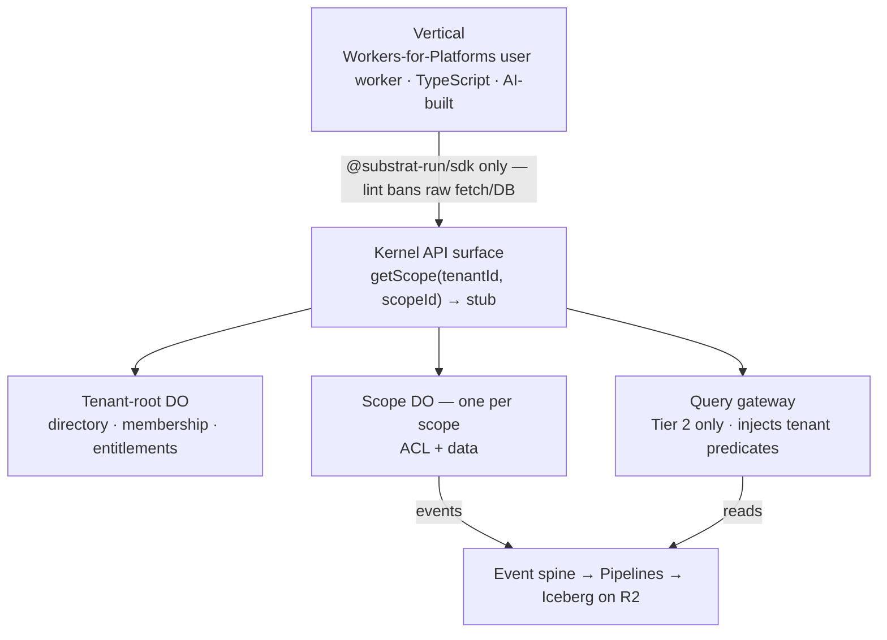

# Substrat Kernel — Design Document

Status: draft v0.1 · Last updated: 2026-07-12

> **Relationship to the master plan.** [docs/master-plan.md](../master-plan.md) is canonical
> for strategy, architecture *decisions*, and the decision log — this document never
> re-decides anything decided there. This document is canonical for the technical *shape*
> of those decisions: contracts, data models, interfaces, lifecycles. Where a shape here
> turns out to force a strategy change, the master plan gets a decision-log entry first,
> then this document follows. Section references like (§5.2) point into the master plan;
> references like (D-4) point to its decision log.

Anonymization follows the master plan: **PropCo**, **HouseCo**, **POSCo**, **MediaCo**,
**the auth platform**, **the FSM vendor**.

---

## 1. Purpose, scope, non-goals

**Purpose.** Specify the kernel precisely enough that (a) implementation can start on
case 1 (förvaltar-OS, §8.1), (b) the techy friend's RFC (§13.3) can be exported from it,
and (c) the agent-loop acceptance test (§5.6) has concrete contracts to run against.

**Scope — the one-step-ahead rule (§6) applied.** This document designs, in order of
retrofit brutality:

1. Tenancy model + directory + provisioning (§5.1, D-3)
2. Permission model (D-16)
3. Event envelope + spine (§5.3, D-5)
4. Module manifest + attachment contracts (D-1)
5. Scope-host contract and the two storage shapes (§5.2, D-4, D-14)
6. The adapter seam for everything the kernel consumes (§5.7, D-18)
7. i18n conventions (§6)

**Non-goals for v0.1.** Engines (work orders, protocols — designed in their own docs when
case 1 forces extraction); the integrations hub beyond its contract stub; billing rails;
the AI gateway; spec-registry tooling (§5.6 defers it); anything only a second vertical
would consume.

## 2. System topology



Invariants this picture encodes (§4):

- The **only** data path from vertical code to operational data is the scope stub. The
  stub is capability-scoped: holding it *is* the authorization to talk to that scope, and
  the scope DO still re-validates every call against its own ACL (§5.4).
- The **only** analytical path is the query gateway; it injects tenant/scope predicates
  before the query reaches the engine.
- Events are emitted by kernel/engine code below the API surface. Vertical code cannot
  emit, suppress, or edit audit events.
- Ambient tenancy (§7.8): vertical code never passes tenant/scope IDs after obtaining a
  stub — context rides inside the stub.

## 3. Core data model: tenant, scope, directory

### 3.1 Entities

```ts
interface Tenant {
  id: TenantId;               // branded string, ULID
  slug: string;               // stable, URL-safe, unique
  name: string;
  status: 'active' | 'suspended' | 'deleting';
  createdAt: Instant;
}

interface Scope {
  id: ScopeId;                // branded, ULID; globally unique (not per-tenant)
  tenantId: TenantId;
  parentScopeId: ScopeId | null;  // v1: always null (two levels); field exists so
                                  // deeper trees are additive, not a migration
  slug: string;               // unique within tenant
  kind: string;               // vertical-defined vocabulary: 'brf', 'filial', 'brand'…
  name: string;
  status: 'provisioning' | 'active' | 'suspended' | 'archiving' | 'archived';
  storageShape: 'A' | 'B';    // §5.2; fixed at provisioning, migration is explicit
  jurisdiction: 'eu' | null;  // CF DO jurisdiction; fixed at creation — a DO can
                              // never relocate. 'eu' default for our markets (§7.3)
  schemaVersion: string;      // last applied migration journal entry (§6 below)
  createdAt: Instant;
}
```

Decisions embedded here, open to challenge:

- **Two levels in v1, tree-ready schema.** Every known case is two-level (§5.1). The
  `parentScopeId` column ships day one because *the column* is cheap and *the retrofit*
  is not; the permission model (§4 below) is written against a path, not a level count.
- **ScopeId globally unique**, so a scope stub, an event, or an opaque ref never needs
  the tenant for disambiguation — but every kernel API still requires the pair
  `(tenantId, scopeId)` and cross-checks it, so a confused-deputy bug in vertical code
  fails closed instead of resolving to another tenant's scope.
- **`kind` is vertical vocabulary, not kernel enum.** The kernel never branches on it.

### 3.2 Directory

DOs are not enumerable (§5.2), so the directory is load-bearing: it is the **only**
complete inventory of tenants and scopes, and the input to reconciliation, migration
sweeps, billing (active-scope meter, §9), and ops.

- One **tenant-root DO** per tenant: scope registry for that tenant, membership, role
  assignments, entitlements. Lightweight by rule — it holds control-plane state only.
- One **global directory** (D1 in the Cloudflare adapter; a SQLite file in the pure
  adapter): tenant registry + denormalized scope index `(tenantId, scopeId, status,
  shape, schemaVersion, lastWakeAt)`.
- Write ordering: the tenant-root DO is the source of truth for its scopes; the global
  index is an async projection off its events, and reconciliation treats the tenant-root
  as authoritative. A scope missing from the global index is a *sweep bug*; a scope
  missing from its tenant-root is *corruption* and pages someone.

### 3.3 Provisioning lifecycle

`provisioning → active → suspended ⇄ active → archiving → archived`

- Provisioning is idempotent and journaled in the tenant-root DO: create registry row →
  initialize scope DO (schema to current version, seed ACL) → mark active. A crash
  between steps re-runs safely.
- Jurisdiction is a provisioning-time decision: the scope DO is minted inside a
  jurisdiction sub-namespace (`env.SCOPE.jurisdiction('eu').newUniqueId()`) and the
  guarantee covers where the object runs **and** persists. It can never change after
  creation, which is why it lives on the `Scope` row, not in runtime config. The DO ID
  itself is logged outside the jurisdiction for billing/debug — fine (opaque ULIDs), but
  it belongs in the trust-page fine print.
- `archived` keeps the registry row and Tier 2 history forever (bokföringslagen, §5.3);
  the scope DO's storage is exported to R2 then released. Un-archive is a restore, not a
  flag flip — this keeps the "active scope" billing meter honest (§9).

## 4. Permission model

The model is kernel-owned; the evaluation engine is an adapter (D-16). The model must be
decided now (§6: "near-impossible to retrofit"), so this section is the highest-stakes
part of this document.

### 4.1 Authored surface: roles @ nodes + capability grants

What humans and agents write. Verticals never see the evaluation machinery below.

```ts
// The tree of assignable nodes: tenant root, or any scope.
type Node = { tenantId: TenantId; scopeId: ScopeId | null };  // null = tenant level

// A role is a named bundle of permissions, module-declared or vertical-declared.
interface RoleDefinition {
  key: string;                 // 'staff', 'field-tech', 'board-member', 'resident'
  permissions: PermissionKey[];// e.g. 'workorder:create', 'document:read'
  source: ModuleId | 'vertical';
}

// Assignment: a principal holds a role at a node; inheritance flows down the tree.
interface RoleAssignment {
  principalId: PrincipalId;    // user or service principal
  roleKey: string;
  node: Node;
}

// Capability grant: a narrow, direct, time-boxable permission at a node,
// bypassing roles. Also the cross-tenant mechanism (§5.4). The optional entity
// narrows the grant to one entity and its declared descendants — this is how
// portal customers see only THEIR facilities/orders inside a shared scope
// (the FSM shape: end customers within a filial; see the feature survey §8).
interface CapabilityGrant {
  principalId: PrincipalId;
  permission: PermissionKey;
  node: Node;
  entity?: EntityRef;          // entity-narrowed grant (portal customers)
  expiresAt?: Instant;
  grantedBy: PrincipalId;      // audited, always
}
```

**The check API — the seam the adapter sits behind (D-16):**

```ts
interface PermissionChecker {
  check(principal: PrincipalId, permission: PermissionKey, node: Node): Promise<Decision>;
  // An allow ALWAYS carries its proof: the tuple chain that granted access
  // (§4.2) — powering explain, "view as user" (§7.8), and the reviewable diff.
  explain(principal: PrincipalId, node: Node): Promise<EffectivePermissions>;
}
```

Rules unchanged by the evaluation choice:

- **Deny by default; no negative grants** (K-2). If a real case demands exceptions,
  model them as narrower roles; revisit only with a decision-log entry.
- **Inheritance is downward only** (tenant → scope → future sub-scopes).
- **Permission keys are module-namespaced** and declared in the module manifest (§7) —
  the manifest keeps "who can do what" enumerable and diffable.

### 4.2 Evaluation: a constrained relationship-tuple engine (K-12, plan D-23)

The built-in evaluator is a deliberately small FGA/Zanzibar-shaped engine. Internal
representation: `(subject, relation, object)` triplets —
`principal:… member org:…`, `org:… customer_of facility:…`,
`workorder:10024 parent facility:X`, `principal:… role:staff scope:…` — stored
scope-locally, with the tenant-level slice cached from the tenant-root DO and
invalidated by assignment events.

**The derivation algebra is fixed — four rules, not configurable:**

1. Role bundles expand to their permission keys.
2. Permissions inherit down the tenancy tree (`parent` edges between nodes).
3. Permissions flow along **manifest-declared entity parent edges** (§7.1
   `entityRelations`), depth-capped (4). This is what resolves
   "may Anna read workorder:10024?" → workorder→facility→customer-org→member.
4. Membership (principal → org/group).

No negation, no intersections, no vertical-authored rewrites. Every future "can we just
add…" against this list is a decision-log event, not a patch — the algebra's smallness
is what keeps `explain` and the §4.5 diff tractable.

**Why this is small here when Zanzibar is not:** Zanzibar's hard problems (snapshot
consistency, the new-enemy problem, zookies) exist because Google evaluates against a
globally distributed tuple store. Our tuples live in the scope's serialization domain
(§5.1): check-after-write consistency is free, and a revoked tuple is invisible to the
very next operation. What remains is a bounded recursive query over scope-local rows —
a few hundred lines behind `PermissionChecker`.

**Proof paths.** An allow returns the tuple chain that produced it. `explain` is the
same walk enumerated; "view as user" renders screens against it; the human checkpoint
diff renders tuple-set changes as "who gains what, where."

**OpenFGA stays the swap target** (D-16): the tuple model is conceptually OpenFGA's, so
the adapter swap is a data migration, not a remodel.

### 4.3 Identity sync: authhero organizations

End-customer companies (portal users) are authhero **organizations**; login uses the
existing refresh-token → org-scoped access-token exchange. Division of labor:

- **Identity layer** (adapter): authentication, org membership management, session
  narrowing — the org claim selects which grants are active when the kernel entrypoint
  mints the stub (K-8).
- **Kernel** (canonical, D-16): the enforcement facts — membership tuples and
  entity-narrowed grants. Provisioning a portal customer creates both the kernel
  tuples and the authhero org/membership; **the org is a projection of the kernel
  directory, never the reverse**. Token claims are never trusted at data access — the
  owning scope re-evaluates tuples on every call (§5.4).

### 4.4 What v1 must express (acceptance list)

From PropCo (§8.1): staff with tenant-wide roles; fältpersonal with a role at many-but-
not-all scopes; a styrelse member with a role at exactly one BRF scope; a boende with a
portal role at one scope; a subcontractor principal holding a time-boxed capability grant
into one scope from *another tenant* (the §8.4 wedge, designed-for now, shipped later).
From the FSM shape (feature survey §8): a **portal customer seeing only their own
facilities and orders inside a shared filial scope** — an entity-narrowed grant resolved
through declared entity parent edges (§4.2 rule 3). If the model can't express one of
these cleanly, the model is wrong — fix it here before schema.

### 4.5 Human checkpoint surface

Permission *definitions* (role definitions, manifest permission keys) change only via
reviewed migration — this is one of the two non-negotiable human checkpoints (§4 of the
plan). The kernel renders any such change as a single human-readable diff: which
principals gain/lose what, where in the tree (§7.8). Assignments (giving a user a role)
are runtime data, audited but not human-gated.

## 5. Scope-host contract and storage

### 5.1 The contract

```ts
interface ScopeHost {
  // Kernel authenticates the caller and mints the stub with trusted principal
  // context (K-8); a mismatched (tenantId, scopeId) pair fails closed (K-3).
  getScope(principal: PrincipalId, tenantId: TenantId, scopeId: ScopeId): Promise<ScopeStub>;
  // Modules register operations at composition time; handlers run INSIDE the scope.
  defineOperation<I, O>(name: string, handler: OperationHandler<I, O>): void;
}

// The stub is the enforcement primitive: capability-scoped (minted per principal
// per scope), revalidated by the owning scope on every call (§5.4), and the ONLY
// way code outside the scope reaches it. Callers invoke module-registered
// operations by name — closures can't cross RPC, and this is what keeps
// "one hop, then local queries" true in production (K-10).
interface ScopeStub {
  invoke<O, I>(operation: string, input?: I): Promise<O>;
}

// What an operation handler sees inside the scope — ambient tenancy, no IDs:
interface OperationContext {
  sql: ScopedSql;                      // module-owned tables in this scope only
  attachments: AttachmentApi;          // documents, comments, custom fields, timeline
  emit(event: DomainEventInput): void; // spine-bound; envelope stamped kernel-side
  check(permission: PermissionKey): Promise<Decision>;  // ambient principal + node
}
```

The adapter boundary sits exactly here (§5.7): the Cloudflare adapter backs the stub with
a Durable Object; the pure adapter backs it with an in-process actor holding one SQLite
file per scope, preserving serialized-execution semantics. **Contract tests run against
both, forever** (D-14).

Two semantics are pinned as *contract*, not adapter behavior (K-6; resolves former open
question 7):

- **Strict serialization per scope.** Operations on one scope execute one at a time, to
  completion. The DO over-delivers (input/output gates allow subtler interleavings); the
  pure adapter implements a per-scope task queue. Kernel and module code may never depend
  on any interleaving subtler than strict — the conservative semantics are the portable
  ones.
- **A serialization boundary on the stub.** Arguments and results pass through structured
  clone even when the adapter is in-process, so code can never share mutable state with a
  scope — the one way a local adapter would silently diverge from RPC. The contract tests
  enforce this by construction.

### 5.2 Shapes A and B

Both shapes present the identical `ScopeStub`; the difference is invisible above the
contract (§5.2 of the plan):

| | Shape A | Shape B |
|---|---|---|
| Primary store | DO-embedded SQLite | per-tenant D1 |
| DO's job | *is* the database | control plane: ACL, entitlements, locks, counters — mediates every access |
| Right for | document-spaces product (consumer #2, D-17) | förvaltar-OS (pending §11 benchmark) |
| Ops path | PITR per scope | D1 read replicas, wrangler tooling, export |

Open (§11): Shape B for case 1 is presumed, not confirmed — the DO-SQLite limits
benchmark decides. This document treats shape choice as per-vertical configuration, which
is why it lives on the `Scope` row.

### 5.3 Migrations and version skew

- Modules own their tables and Drizzle migrations (D-6). The kernel owns the *journal
  protocol*: each scope records applied versions per module.
- Migrations run **lazily on wake**: scope DO init compares its journal to the deployed
  version and applies forward migrations before serving.
- A **reconciliation sweep** walks the directory and wakes stragglers before a deadline.
- Therefore: **schema version skew across live scopes is a normal state** (§5.2). Kernel
  and engine code must tolerate a declared skew window; the manifest declares each
  migration's `compatibleFrom`, and CI fails a module whose code reads a column its own
  skew window says may not exist yet.
- **Expand–contract is mandatory, CI-enforced.** A release may add (tables, nullable
  columns, backfills); destructive steps (drop, rename, tighten) must land in a *later*
  release than the code that stopped using the old shape. The sweep's completion closes
  the skew window; only then may the next release contract.
- **Failure is per-scope and fails closed.** A throwing migration fails that scope's
  init — one scope down, not the fleet. The sweep retries with backoff and pages past a
  threshold; recovery is per-scope PITR + a patched forward migration. Sweep progress
  ("release 42: 487/500 migrated, 13 pending, 0 failed") is a first-class ops-console
  view.
- **Large backfills are jobs, not migrations.** The migration adds the shape; a chunked
  job (alarm-driven) backfills and marks completion in the journal separately. Backfill
  writes are flagged so they don't pollute the event spine as fake user activity.
- **Review looks at generated SQL, not the schema diff alone** — SQLite's limited
  `ALTER TABLE` turns some renames into create-copy-rename table rebuilds, which matters
  at 10 GB.
- Shape B difference: the control plane may drive the same journal *externally* via the
  D1 HTTP API instead of waiting for wake; the wake-time version check still guards
  serving.
- Human checkpoint: migrations are the second non-negotiable review gate (§4 of the
  plan). `substrat migrate --dry-run` renders the diff per shape; agents can propose,
  never apply.

### 5.4 Operating the scope fleet

- **Inspection.** Cloudflare's Data Studio (dashboard) views and writes SQLite-backed DO
  storage per instance, and Local Explorer gives the same SQL studio in `wrangler dev`.
  Both are per-instance: finding "the DO for BRF X" always goes through the directory.
  There is **no external programmatic path** to DO storage (unlike D1's HTTP API) —
  programmatic ops go through an audited admin-query RPC on the scope DO, surfaced only
  in the platform ops console (§6 of the plan). Locally, the pure adapter is plain
  `.sqlite` files.
- **Fleet questions never fan out.** Cross-scope queries go to Tier 2; the directory
  index answers fleet metadata (versions, status, last wake).
- **Rollback is per-scope PITR**, making a bad deploy or migration a controlled failure
  of the scopes it actually touched.
- **Shape B's ops trade**, stated once: D1 tooling (HTTP API, Time Travel, export,
  read replicas) in exchange for a network hop per query instead of per request, softer
  residency guarantees (open question 7), and coarser sharding (per-tenant 10 GB rather
  than per-scope).

### 5.5 Deployment topology and routing

- **One kernel-runtime deployment per vertical** hosts that vertical's scope-DO class —
  the scope schema is kernel + engines + the vertical's modules, and module code
  (migrations, invariants) executes inside the scope DO, so all scopes of a vertical run
  identical code and different verticals are separate deployments with separate DO
  namespaces. Blast radius and versioning are per-vertical. Orchestrating N such
  deployments is control-plane work (open question 9).
- **Vertical app code deploys as WFP user workers** with exactly one privileged binding:
  a service binding to the kernel entrypoint, which authenticates the request, derives
  the principal, and mints capability stubs (`getScope`). **Never a raw DO namespace
  binding** (K-8): WFP supports attaching one, but a raw binding would let vertical code
  address arbitrary scope IDs and assert principals; the DO's internal ACL check stays as
  defense in depth, not the first line.
- **Custom domains** ride Cloudflare for SaaS custom hostnames: a kernel-owned router
  worker resolves hostname → `(tenant, scope, vertical)` in the directory (the
  hostname→scope map is directory data; hostname provisioning — custom-hostnames API,
  DNS validation, cert lifecycle — is part of scope provisioning) and dispatches to the
  vertical's user worker. Kernel-owned surfaces short-circuit at the router straight to
  the scope DO: webhook ingress, auth callbacks, and WebSocket upgrades — realtime
  terminates on the scope DO, which is where the plan's "realtime nearly free" claim
  cashes out.

## 6. Event spine

### 6.1 Envelope (the schema-versioned contract, D-5)

```ts
interface DomainEvent<T = unknown> {
  id: EventId;                    // ULID; idempotency key downstream
  type: string;                   // 'workorder.completed' — module-namespaced
  schemaVersion: number;          // per event type; AsyncAPI is the source (§5.6)
  occurredAt: Instant;
  tenantId: TenantId;             // stamped by kernel, not caller
  scopeId: ScopeId;               // "
  actor: PrincipalId | SystemActor;
  entity: EntityRef;              // opaque (entity_type, entity_id) — §3 of the plan
  piiClass: 'none' | 'pseudonymous' | 'direct';  // drives crypto-shredding (§5.3)
  subjectId?: DataSubjectId;      // present iff piiClass ≠ 'none'; keys the shred
  payload: T;                     // validated against generated JSON Schema on emit
}
```

Non-negotiables:

- Tenant/scope/actor are **stamped by the kernel** from the stub's ambient context —
  a vertical cannot mislabel an event's origin.
- `piiClass` and `subjectId` are required at the type level in the AsyncAPI spec: an
  event type that *could* carry PII cannot be declared without classification. This is
  the kernel convention that makes lake-side crypto-shredding (§5.3) total rather than
  best-effort.
- Emission is transactional with the write it describes (outbox in scope storage,
  drained to Pipelines) — an event without its write, or a write without its event, is
  a bug class the contract tests target explicitly.

### 6.2 Consumption

Engines subscribe to event types (declared in their manifest), never to each other's
internals — the star topology (D-19). Delivery is at-least-once with the event `id` as
idempotency key; consumers are required-idempotent, and the contract test suite includes
a duplicate-delivery harness. Ordering is guaranteed only within (scope, module) —
never across modules or globally (§7.3, K-11).

## 7. Module system: manifest + attachment contracts

### 7.1 Manifest

The manifest is what makes an engine self-describing to agents and buyers (§5.6). One
file, spec-first, checked into the module package:

```ts
interface ModuleManifest {
  id: ModuleId;                    // '@substrat-run/engine-workorder'
  version: string;                 // semver; kernel enforces (§6 of the plan)
  kernelContract: string;          // semver range of kernel API it targets
  permissions: PermissionDeclaration[];   // keys + human descriptions (fuel for §4.3 diffs)
  events: { emits: EventTypeRef[]; consumes: EventTypeRef[] };  // AsyncAPI refs
  migrations: MigrationJournalRef; // Drizzle journal + skew windows (§5.3 above)
  attachmentTargets: EntityTypeDeclaration[]; // entity types it exposes to attachment
  entityRelations?: EntityRelation[];         // declared parent edges, e.g. workorder→facility;
                                              // permission flows along them (§4.2 rule 3)
  entitlementKey: string;          // the SKU flag that gates loading (D-20)
  api?: OpenApiRef;                // emitted OAS for the HTTP surface, if any (D-22)
  searchables?: SearchableDeclaration[];   // FTS/vector registration (§6 of the plan)
  ui?: UiContributions;            // routes, nav, entity views, widgets (§7.4)
}
```

Loading rule: the kernel loads a module only if the tenant's entitlements include
`entitlementKey` and the semver ranges are satisfiable. Entitlements are kernel-owned
precisely because they gate this loader (D-20).

### 7.2 Attachment contracts

The kernel owns no entities (D-1); it offers services that bind to opaque refs:

```ts
type EntityRef = { entityType: string; entityId: string };  // opaque to the kernel

interface AttachmentApi {
  documents(ref: EntityRef): DocumentCollection;
  comments(ref: EntityRef): CommentThread;
  timeline(ref: EntityRef): ActivityTimeline;   // projection of spine events for ref
  customFields(ref: EntityRef): TypedCustomFields; // JSONB + field-definition registry (D-6)
}
```

Every attachment item (document, comment, custom-field value) carries a mandatory
**visibility classification** (`internal | customer`) from day one (K-13) — the FSM
survey shows internal/external flags pervading every audience-shared surface, and like
`piiClass`, a classification is only total if it was never optional.

The kernel enforces referential *permission* (attachment access checks the permission of
the owning entity's declared permission key) but not referential *integrity* across the
opaque boundary — a module deleting an entity is responsible for emitting the deletion
event; attachment GC is a spine consumer.

### 7.3 Module storage model

Engines own **tables and migrations, never databases**. The decisive reason is
transactional: the outbox pattern (K-4) requires a domain write and its event to commit
in one transaction, and the scope is the consistency domain (D-4) — everything that must
commit together lives in one database. One scope database, shared by every module active
in that scope: kernel tables (`_substrat_*`), engine tables, vertical tables.

Ownership rules:

1. **Namespaced tables.** Each module prefixes its tables (`workorder_*`); the
   `_substrat_` prefix is reserved. Within a module, FKs and joins are fine and
   encouraged.
2. **Cross-module FKs are forbidden.** Cross-module references use the opaque
   `EntityRef` stored as plain columns — the star topology (D-19) applied to schema.
   Engines version and license independently, which physical schema entanglement would
   break. CI-lintable: parse migration SQL, reject `REFERENCES` across prefix
   boundaries.
3. **Migrations are module-owned and module-journaled** (`_substrat_migrations` tracks
   `(module_id, version)`); on wake, each active module's pending migrations apply
   independently — kernel, then engines, then vertical. An engine upgrade never touches
   another module's tables.
4. **Per-tenant flexibility never mutates engine schema.** Tenants get typed custom
   fields (JSONB + registry, D-6), not per-tenant `ALTER TABLE`. Engine schema is
   identical in every scope at a given version — what keeps skew-window reasoning
   tractable.

Honest limit: SQLite has no intra-database permissions, so within a scope, table
ownership is convention + CI lint + the migration review checkpoint — not runtime
enforcement. Correct trade: the boundary the product sells is the tenant/scope boundary
(physical); modules within a scope are co-trusted because the vertical composed them and
a human reviewed the composition.

**The 10 GB question.** 10 GB caps *operational truth only* (blobs → R2, history →
Tier 2, archived scopes export out) — roughly 5–10M live work orders per scope; not a v1
driver. Pressure valves, in order, before intra-scope sharding: (1) **retention into
Tier 2** — closed items keep events in Iceberg, drop operational rows; (2) **split along
the tree** — a 10 GB scope is often two consistency domains wearing one name
(`parentScopeId` is ready); (3) **per-engine databases** — available precisely because
rule 2 forbids cross-module FKs; each shard carries its own outbox. Never shard by user:
B2B data is queried scope-wide and users cross-cut scopes — the consistency domain is
the business unit, never the person.

Shape note: in Shape A, per-engine sharding would mean per-engine DOs and lose
cross-engine serialization; in Shape B one control-plane DO fronts N databases and keeps
a single serialization point while shedding the storage cap. **"Scope outgrew 10 GB" →
that scope migrates to Shape B (or splits), not "shard the DO"** — retroactive
justification for `storageShape` being a per-scope field.

Semantic commitments pinned now — free today, breaking changes once verticals exist
(K-11):

1. **Event ordering is guaranteed only within (scope, module)** — never across modules,
   never globally; consumers are idempotent and cross-module order-tolerant.
2. **No cross-module transaction is ever promised** (star topology already implies it).
3. **The outbox is a per-database mechanism** — one per consistency domain, not "one per
   scope."

### 7.4 UI composition model (K-15)

**Microfrontend outcomes, monolithic build mechanics.** Each vertical is one React app,
composed **at build time** from manifest-declared UI contributions. Runtime federation
(module federation / single-spa) is rejected: it solves independently-deploying teams —
a problem we don't have (one user worker per vertical, engines versioned via npm) — and
costs duplicated framework instances, theming fragmentation, cross-bundle routing/state,
and a larger hallucination surface. One React tree, one router, one design-system
instance; version conflicts caught by the compiler via semver + `kernelContract` ranges.

**Manifest `ui` contributions** — the extension-point model (VS Code-style):

```ts
ui?: {
  routes:         [{ path, screen, permission }];
  nav:            [{ label /* i18n key */, icon, to, permission }];
  entityViews:    [{ entityType, view }];        // the EntityRef → view registry
  widgets:        [{ slot, component, permission }];
  settingsPanels: [{ label, component, permission }];
}
```

The kernel-owned shell reads contributions at the vertical's build, wires routing, and
renders nav/routes **permission-aware from the proof-path checker** — which is also what
makes "view as user" (§7.8 of the plan) a shell feature rather than per-screen
discipline.

**The entity-view registry is the star topology in the UI layer.** A screen showing a
provenance ref `EntityRef{workorder, 10024}` never imports workorder UI — it asks the
registry "who renders `workorder`?" Cross-engine UI composition through opaque refs,
zero imports between engine UI packages: the same rule as the data layer (D-19),
falling out of the attachment contracts.

**Engine UI packages are headless-first.** Hooks/data layer (`useWorkOrders()`, state
machines, SDK permission checks) separate from the presentation components. Three
override levels for a vertical: (1) theme tokens; (2) **copy-and-own** — engine screens
are generated *into* the vertical shadcn-style, so agents edit concrete files rather
than fighting an abstraction (the §7.8 generation-time-governance lesson); (3) replace
entirely, keeping the headless layer.

**The shell and what sits above it:**

- `@substrat-run/shell` — seeded from shadcn-admin as a one-time copy (proven on the auth
  platform), then stripped and owned: auth pages replaced by identity-adapter flows,
  nav replaced by the contribution renderer. The shell stays domain-free — kernel
  chrome only (org/scope switcher, permission-aware nav, settings, members, audit
  viewer, notifications, connector UI).
- **Pattern kit** — the actual differentiator, one level above the shell: the recurring
  vertical-software screen patterns the FSM survey documents (survey §7): master-data
  panel + tabbed detail + related-entity tables, filtered lists with saved views and
  counts, status flows, entity cards, visibility-aware rendering. Built from shadcn
  primitives; **the vocabulary agents compose screens from** — patterns, not divs.
- **Three surfaces**, one headless layer: office shell (above), **field mobile**
  (one-handed capture flows: accept job, checklist + photo, time, signature — a
  separate lightweight shell), **customer portal** (consumer-grade, per-tenant
  brandable, tiny surface). Specialized components (dispatch board, planning calendar,
  map) are buy/adopt decisions deferred to the engines that need them (one-step-ahead).

**Escape hatch, not foundation:** a future `slot` contribution type accepting a web
component gives isolated islands in other frameworks (one legacy widget, not a polyglot
architecture). Additive — designed for, not built.

## 8. Adapter matrix (D-14, D-18)

Every row: pure TypeScript interface; two adapters minimum; contract tests pass on both.

| Contract | Cloudflare adapter | Pure adapter | v0.1? |
|---|---|---|---|
| ScopeHost | Durable Object | in-process actor + SQLite file per scope | ✅ |
| Directory index | D1 | SQLite | ✅ |
| Event transport | Pipelines → Iceberg/R2 | append to local Iceberg (or JSONL→DuckDB) | ✅ |
| Query gateway engine | R2 SQL | DuckDB over same Iceberg | ✅ |
| Jobs/cron/workflow state | Queues, Cron, Workflows | SQLite job table + poller | ✅ |
| Identity | — (adapter is the auth platform, default) | same, or stub issuer for tests | ✅ |
| Permission evaluation | built-in default | same code (it's pure); OpenFGA later | ✅ |
| Blob storage | R2 | filesystem | ✅ |
| Key management | CF secrets | local encrypted store | ✅ (shredding needs it) |
| Notification transport | Resend/SES/SMS | console/file sink | stub |
| Telemetry | OTel → Datadog | OTel → stdout | convention only |
| Search backends | D1/FTS + Vectorize | SQLite FTS5 + sqlite-vec | defer to first search consumer |

Never adapters (D-18): event spine semantics, tenancy/permission model, entitlements,
module manifest.

## 9. Repository and package layout (§5.8)

pnpm monorepo, published as:

```
@substrat-run/sdk               — the narrow typed surface verticals import (the only import)
@substrat-run/kernel            — contracts + kernel services (runtime-agnostic core)
@substrat-run/adapter-cloudflare
@substrat-run/adapter-sqlite
@substrat-run/contracts             — Zod contract schemas (source of truth, D-22) + emitted
                             OAS/JSON Schema artifacts, checked in and CI-diffed
@substrat-run/cli               — `substrat dev` (pure-SQLite composition), migrate --dry-run,
                             scaffold; the MCP server ships here
@substrat-run/contract-tests    — the suite every adapter and module must pass
engines/*                  — manifest-carrying packages, versioned independently
demos/*                    — demo verticals (private, never published): demos/fsm first,
                             demos/bikeshop later reusing the same engines (reuse proof)
```

Lint/CI guardrails shipped from day one (§5.6): ESLint rules banning raw `fetch`, raw DB
drivers, and `Date`-based ID generation in vertical code; contract tests as the module
admission gate; both adapters green as a merge requirement.

## 10. Enforcement model — mechanism per guarantee

The §4 (plan) claims, restated as testable mechanisms — this table is the spec for the
isolation test suite and the 15-minute demo's failure moment:

| Generated code cannot… | Mechanism | Test |
|---|---|---|
| read another tenant's data | data only reachable via `ScopeStub`; DO revalidates caller ACL on every call; `(tenantId, scopeId)` cross-check fails closed | adversarial vertical attempts stub forgery, ID swap, direct DO addressing |
| leak tenants in reporting | gateway injects tenant/scope predicates; verticals hold no lake credentials | query with missing/foreign predicate → rejected, audited |
| call third-party APIs raw | credentials live in the hub; lint bans `fetch`; egress policy on user workers (WFP) | vertical with hand-rolled fetch fails CI *and* runtime egress |
| skip or forge audit | envelope stamped kernel-side; emission transactional via outbox | write-without-event harness; origin-spoof attempt |
| mislabel PII | `piiClass` required by event-type schema; emit validates against generated schema | unclassified event type fails spec build |
| self-approve schema/permission changes | migrations + permission definitions only apply via reviewed path; agents get dry-run only | `substrat migrate` without approval token is inert |

## 11. Testing strategy

1. **Contract tests** (`@substrat-run/contract-tests`): every kernel contract, run against
   both adapters in CI, forever (D-14). Includes the duplicate-delivery, skew-window, and
   crash-during-provisioning harnesses.
2. **Isolation suite**: the §10 table above, run adversarially; results published (the
   trust page, §7.8 commercial lessons).
3. **Reconciliation invariant**: Tier 2 sums = Tier 1 balances on a seeded synthetic;
   runs continuously in staging.
4. **The agent loop as acceptance test** (§5.6): Claude Code + manifest + specs + one
   reference vertical scaffolds a new toy vertical to the two human checkpoints, with
   only mechanical pushback. This is the recurring benchmark and the demo (§13.4).

## 12. Milestone 1: the 15-minute demo — minimum kernel cut

What must exist, and nothing more (§13.4): directory + provisioning for two tenants ×
two scopes · permission model with `check`/`explain` · scope stub on the **pure-SQLite
adapter only** (Cloudflare adapter may lag — the demo is about contracts, not hosting) ·
event envelope + local spine · module manifest loading a toy engine · `substrat dev` +
scaffold + specs enough for the agent loop · the isolation suite's tenant-boundary test,
shown **failing the attack live**.

Explicitly deferred past milestone 1: Tier 2 gateway (log events locally, query later),
documents service, integrations hub, notifications, search, i18n *content* (the string
externalization convention is day one; translations are not).

## 13. Open design questions (technical siblings of §11 in the plan)

1. Permission model: does §4.4's acceptance list hold against PropCo's real org chart?
   Walk it with real names before freezing schema. (Evaluation engine decided: K-12,
   plan D-23.)
2. Stub minting and transport: exact capability format (signed token vs DO-held session)
   — needs a security review pass of its own.
3. Outbox drain semantics on Shape A vs B — same contract, different failure modes;
   enumerate them before the contract tests are written.
4. Skew-window declaration format in the manifest — per-migration or per-release?
5. Tenant-root DO scope: is entitlement checking on its hot path (every module load) or
   cached in scope DOs with event invalidation?
6. `EntityRef.entityId` format — require ULIDs from modules, or accept opaque strings and
   forbid ordering semantics?
7. Shape B EU-residency wording: DO jurisdictions are a hard guarantee, but D1 offers
   location *hints*, not jurisdiction guarantees — verify D1's current residency story
   before making EU claims for Shape B verticals (Shape A and Tier 2/R2 are covered).
8. Latency budgets for the storage-shape benchmark (§5.2): set p50/p95 budgets *before*
   running it — e.g. a portal page and a work-order mutation, EU user → router →
   vertical worker → kernel → scope, warm and cold, DO-primary vs D1-primary.
9. Per-vertical kernel deployments (§5.5): how does the control plane orchestrate N
   deployments' versions, and where does a shared-engine upgrade roll first?
10. Shape B physical layout: one D1 per tenant (scope isolation via adapter-injected
    `scope_id` predicates — weaker physical story) or one D1 per scope (~50k databases
    per account allowed — keeps §7.3's model identical across shapes)? Decide in the
    storage-shape benchmark.
11. Cross-engine transition guards (FSM survey §8: "obligatorisk för status" —
    checklist completion blocks order status transitions): vertical-owned orchestration
    (visible glue, but droppable by AI edits — weak for compliance-grade gates) vs a
    manifest-declared guard the kernel evaluates before the transition (all modules
    share the scope DB, so it's cheap). Decide when the protocol engine lands; the
    manifest change is additive.

## 14. Design log

| # | Date | Design decision | Notes |
|---|---|---|---|
| K-1 | 2026-07-12 | `parentScopeId` column ships in v1 even though trees are two-level | Column cheap, retrofit brutal; permission model written against paths |
| K-2 | 2026-07-12 | Deny-by-default, no negative grants in v1 | Keeps `explain` and the human-readable permission diff tractable |
| K-3 | 2026-07-12 | ScopeIds globally unique; APIs still take and cross-check the pair | Confused-deputy bugs fail closed |
| K-4 | 2026-07-12 | Event emission transactional via outbox in scope storage | "Write without event" becomes a tested bug class, not a convention |
| K-5 | 2026-07-12 | Milestone-1 demo runs on the pure-SQLite adapter only | Proves contracts-first is real; Cloudflare adapter may lag the demo |
| K-6 | 2026-07-12 | Strict per-scope serialization + structured-clone stub boundary are contract semantics, not adapter behavior | Conservative semantics are the portable ones; resolves former open question 7 |
| K-7 | 2026-07-12 | `jurisdiction` on the Scope row, chosen at provisioning, immutable; `eu` default | DOs can never relocate; jurisdiction covers run + persist — the EU-sovereignty mechanism (§7.3) |
| K-8 | 2026-07-12 | Verticals never hold raw DO namespace bindings; one service binding to the kernel entrypoint, which authenticates and mints stubs | Stub minting with trusted principal context is the enforcement point; DO ACL stays defense in depth |
| K-9 | 2026-07-12 | Contracts Zod-first via zod-openapi on Hono; OAS/JSON Schema emitted + CI-diffed; no TypeSpec design phase — the contracts package is the design artifact | Implements master-plan D-22; reference implementation is in-memory/pure-SQLite, never throwaway mocks |
| K-10 | 2026-07-12 | Stub exposes `invoke(operation, input)`; `sql`/`emit`/`check` live in the `OperationContext` handlers see inside the scope | Closures can't cross RPC; module code runs colocated with data (§5.5), preserving "one hop, then local queries" on the DO adapter |
| K-11 | 2026-07-13 | Module storage model (§7.3): engines own namespaced tables + module-journaled migrations in the shared scope DB, never databases; no cross-module FKs; event ordering only within (scope, module); no cross-module transactions promised; outbox is per-database | Outbox atomicity requires one DB per consistency domain; forbidding cross-module coupling keeps per-engine sharding and Shape B migration available as ops changes, not contract changes |
| K-12 | 2026-07-13 | Permission evaluation = constrained relationship-tuple engine (§4.2): fixed four-rule algebra, no negation/config, scope-local tuples, proof-path decisions; grants gain optional entity narrowing; manifests declare entity parent edges | Implements plan D-23; the FSM portal-customer case needs entity-graph resolution; per-scope serialization makes the mini-engine small (no zookies) |
| K-13 | 2026-07-13 | Attachment items carry mandatory `visibility: internal \| customer` | FSM survey: internal/external flags pervade every portal-shared surface; classifications are only total if never optional (same reasoning as piiClass) |
| K-14 | 2026-07-13 | Shared `money` schema in @substrat-run/contracts: decimal-string amount + ISO 4217 code, branded; engines never invent money representations | Multi-currency evidence (SEK/NOK) + Tier 1/Tier 2 reconciliation needs uniform money handling |
| K-15 | 2026-07-13 | UI composition (§7.4): build-time composition of manifest-declared `ui` contributions into one React app per vertical; entity-view registry for cross-engine rendering; headless-first engine UI with copy-and-own screens; `@substrat-run/shell` seeded from shadcn-admin; three surfaces (office/field/portal); runtime microfrontends rejected; web-component slot kept as future escape hatch | Federation solves team-scale deployment we don't have and costs theming/versioning/agent ergonomics; the manifest, proof-path checker, and EntityRef registry are exactly the primitives a pluggable UI needs |
| K-16 | 2026-07-13 | In-scope composition (demos/fsm/spec/testrun.md §9.2): engines export plain functions taking `ctx`; a vertical's operation may call them — same transaction, same serialization; registered operations are default bindings of these functions. Plus `ctx.link(child, parent)` writing manifest-declared relation tuples, and kernel-managed at-least-once local event dispatch with a `_substrat_deliveries` journal | Vertical-owned orchestration (D-19) needs one-transaction composition (e.g. price-then-complete); invariants hold because everything still flows through ctx; `link` is the write path for D-23 rule 3 |
